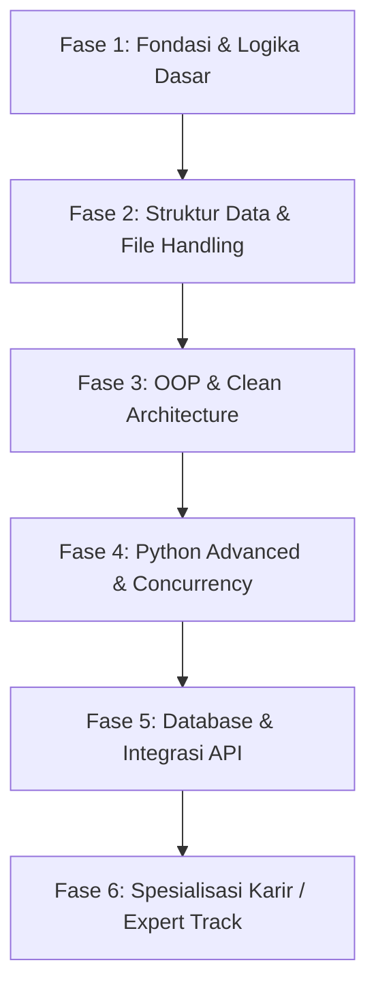

# 🚀 ROADMAP BELAJAR PYTHON: ZERO TO HERO (LOW TO EXPERT)
> Disertai **Daftar PR / Tugas Latihan Praktik Nyata** untuk setiap fase. Kerjakan file tugas di dalam folder ini!

---

## 📌 ALUR FASE BELAJAR



---

## 🟢 FASE 1: FONDASI & LOGIKA DASAR (Low Level / Pemula)
**Target:** Menguasai sintaks, tipe data dasar, operator, percabangan, perulangan, dan fungsi.

### 📚 Materi Inti:
- Variabel & tipe data primitif (`int`, `float`, `str`, `bool`)
- Operator aritmatika, perbandingan, dan logika
- Percabangan (`if`, `elif`, `else`)
- Perulangan (`for`, `while`, `break`, `continue`, `range()`)
- Fungsi dasar (`def`, `return`, default arguments, parameter)

---

### 📝 DAFTAR PR / TUGAS FASE 1:

#### 📌 PR 1.1: Kalkulator Aritmatika Interaktif CLI
- **File:** `pr_01_kalkulator.py`
- **Spesifikasi Tugas:**
  1. Program menampilkan menu pilihan operasi: Penjumlahan, Pengurangan, Perkalian, Pembagian, Modulo, Pangkat, dan Keluar.
  2. Meminta input dua angka dari user.
  3. Mencegah error pembagian dengan angka 0 (*ZeroDivision check* menggunakan `if`).
  4. Program terus berjalan dalam loop `while` sampai user memilih menu Keluar.

#### 📌 PR 1.2: Game Tebak Angka Pintar (*High-Low Game*)
- **File:** `pr_02_tebak_angka.py`
- **Spesifikasi Tugas:**
  1. Komputer mengacak angka dari 1 sampai 100 menggunakan modul `random`.
  2. User diberi jatah maksimal 7 kali kesempatan menebak.
  3. Setiap tebakan, beri petunjuk: *"Terlalu Tinggi!"* atau *"Terlalu Rendah!"*.
  4. Jika tebakan benar, tampilkan skor (sisa kesempatan) dan hentikan game.
  5. Jika jatah habis, tampilkan angka aslinya.

#### 📌 PR 1.3: Konverter Suhu Multi-Satuan dengan Fungsi Modular
- **File:** `pr_03_konversi_suhu.py`
- **Spesifikasi Tugas:**
  1. Buat fungsi terpisah: `celsius_to_fahrenheit()`, `celsius_to_kelvin()`, `celsius_to_reamur()`.
  2. Buat fungsi utama `main()` yang menerima input nilai Celcius dan mencetak tabel hasil konversi ke 3 satuan tersebut dengan format rapi 2 angka di belakang koma.

---

## 🟡 FASE 2: STRUKTUR DATA, STRING, & FILE I/O (Elementary)
**Target:** Mampu mengolah kumpulan data (List, Dict, Tuple, Set), manipulasi teks, membaca/menulis file, dan error handling.

### 📚 Materi Inti:
- `list`, `tuple`, `dict`, `set` & comprehension syntax
- String formatting (f-string, `.strip()`, `.split()`, `.join()`)
- Exception Handling (`try`, `except`, `finally`, `raise`)
- File Handling (`with open(...) as f`) untuk `.txt`, `.csv`, `.json`

---

### 📝 DAFTAR PR / TUGAS FASE 2:

#### 📌 PR 2.1: Analisis Frekuensi Kata & Pembersih Teks (*Word Frequency Counter*)
- **File:** `pr_04_word_counter.py`
- **Spesifikasi Tugas:**
  1. Buat string paragraf panjang / baca dari file `sample.txt`.
  2. Bersihkan tanda baca (titik, koma, tanda seru) dan ubah ke huruf kecil (*lowercase*).
  3. Hitung frekuensi kemunculan setiap kata menggunakan `dict`.
  4. Tampilkan 5 kata yang paling sering muncul beserta jumlahnya.

#### 📌 PR 2.2: Aplikasi Buku Kas / Catatan Pengeluaran (JSON Storage)
- **File:** `pr_05_buku_kas.py`
- **Spesifikasi Tugas:**
  1. Fitur: Tambah Pemasukan/Pengeluaran (kategori, nominal, keterangan, tanggal).
  2. Fitur: Lihat Riwayat Transaksi dalam format tabel rapi.
  3. Fitur: Lihat Total Saldo saat ini.
  4. **Wajib:** Data disimpan dan dibaca secara otomatis dari file `transaksi.json`.
  5. Gunakan `try-except` agar jika file `transaksi.json` belum ada, program tidak crash melainkan otomatis membuat file baru.

#### 📌 PR 2.3: Konverter Data CSV ke Format Ringkasan Laporan
- **File:** `pr_06_csv_report.py`
- **Spesifikasi Tugas:**
  1. Baca file CSV daftar nilai siswa (Kolom: Nama, Mata_Pelajaran, Nilai).
  2. Hitung: Nilai rata-rata, nilai tertinggi, dan nilai terendah.
  3. Ekspor hasil analisis ke file baru `ringkasan_nilai.txt`.

---

## 🟠 FASE 3: OOP & CLEAN ARCHITECTURE (Intermediate)
**Target:** Menerapkan paradigma Object-Oriented Programming, modularitas, type hinting, dan struktur project standar industri.

### 📚 Materi Inti:
- Class, Object, Constructor `__init__`, Dunder methods (`__str__`, `__repr__`, `__len__`)
- 4 Pilar OOP: Encapsulation (getter/setter/`@property`), Inheritance, Polymorphism, Abstraction (`ABC`)
- Modular import (`__init__.py`, `__main__.py`)
- Type hinting (`from typing import List, Dict, Optional`) & Virtual Environment (`venv`)

---

### 📝 DAFTAR PR / TUGAS FASE 3:

#### 📌 PR 3.1: Simulator Rekening Bank OOP Lengkap
- **File:** `pr_07_bank_system/` (Folder terstruktur)
  - `account.py` (Base class `BankAccount` & child class `SavingsAccount`, `CheckingAccount`)
  - `customer.py` (Class `Customer`)
  - `main.py` (CLI interface)
- **Spesifikasi Tugas:**
  1. Terapkan enkapsulasi: atribut `__balance` (saldo) berstatus *private*.
  2. Gunakan `@property` dan method `.deposit()` serta `.withdraw()`.
  3. `SavingsAccount` punya bunga bulanan, `CheckingAccount` punya biaya transaksi.
  4. Simpan riwayat mutasi transaksi untuk tiap akun.

#### 📌 PR 3.2: Sistem Manajemen Inventaris Toko & Kasir (Mini Point of Sales)
- **File:** `pr_08_pos_system/`
- **Spesifikasi Tugas:**
  1. Class `Item` (id, nama, harga, stok).
  2. Class `Inventory` (tambah barang, kurangi stok, cek stok menipis).
  3. Class `Transaction` / `Cart` (menghitung subtotal, diskon, dan cetak struk belanja).
  4. Terapkan dunder method `__len__` pada keranjang belanja dan `__str__` pada objek Item.

---

## 🔴 FASE 4: PYTHON ADVANCED & CONCURRENCY (Advanced)
**Target:** Menguasai fitur lanjutan Python untuk efisiensi memori, eksekusi paralel/asinkronus, dan testing.

### 📚 Materi Inti:
- Decorators (custom timing decorator, auth decorator, retry decorator)
- Generators (`yield`) & Iterators untuk streaming data besar
- Context Managers (`__enter__`, `__exit__`, `contextlib`)
- Concurrency: `asyncio` (`async`/`await`), `threading`, `multiprocessing`
- Unit Testing dengan `pytest` & Linter `ruff` / `black`

---

### 📝 DAFTAR PR / TUGAS FASE 4:

#### 📌 PR 4.1: Custom Decorator Suite (Timer, Logger, & Retry Mechanism)
- **File:** `pr_09_decorators.py`
- **Spesifikasi Tugas:**
  1. Buat decorator `@time_it` untuk mengukur durasi eksekusi sebuah fungsi.
  2. Buat decorator `@retry(max_attempts=3, delay=1)` untuk mencoba ulang fungsi jika terjadi Exception.
  3. Buat decorator `@log_execution` untuk mencatat input parameter dan return value ke file log.

#### 📌 PR 4.2: Generator Pembaca File Log Raksasa (Memory-Efficient Log Streamer)
- **File:** `pr_10_log_generator.py`
- **Spesifikasi Tugas:**
  1. Buat generator function dengan `yield` untuk membaca file log baris per baris tanpa meload seluruh file ke RAM.
  2. Filter baris yang mengandung keyword `"ERROR"` atau `"CRITICAL"`.
  3. Hitung jumlah error per jenis secara realtime.

#### 📌 PR 4.3: Asynchronous Multi-URL Fetcher & Scraper
- **File:** `pr_11_async_fetcher.py`
- **Spesifikasi Tugas:**
  1. Gunakan library `asyncio` dan `aiohttp` / `httpx`.
  2. Tembak 10+ endpoint API publik (misal: JSONPlaceholder atau CoinGecko API) secara bersamaan (*concurrent* dengan `asyncio.gather`).
  3. Bandingkan perbandingan waktu eksekusi antara versi `requests` synchronous biasa vs versi `asyncio`.

#### 📌 PR 4.4: Suite Unit Test dengan `pytest`
- **File:** `tests/test_calculator.py`
- **Spesifikasi Tugas:**
  1. Tulis skrip kalkulator/logika bisnis.
  2. Buat test suite lengkap dengan `pytest`: uji input normal, uji batas (*edge cases*), dan uji exception handling (`pytest.raises`).

---

## 🟣 FASE 5: DATABASE & INTEGRASI REST API (Professional)
**Target:** Menghubungkan aplikasi Python ke database dan membuat web service API.

### 📚 Materi Inti:
- SQLite & PostgreSQL dengan library `SQLAlchemy` (ORM) / `SQLModel`
- Migrasi database dengan `Alembic`
- Membangun RESTful API modern dengan `FastAPI`
- Autentikasi JWT (JSON Web Tokens) & Password Hashing (`bcrypt`)

---

### 📝 DAFTAR PR / TUGAS FASE 5:

#### 📌 PR 5.1: REST API Manajemen Tugas (Todo & Notes API) dengan FastAPI & SQLite
- **File:** `pr_12_fastapi_todo/`
- **Spesifikasi Tugas:**
  1. Endpoint CRUD lengkap:
     - `POST /todos` (Buat todo baru)
     - `GET /todos` (Ambil daftar todo dengan filter status)
     - `GET /todos/{id}` (Detail todo)
     - `PUT /todos/{id}` (Update status selesai/belum)
     - `DELETE /todos/{id}` (Hapus todo)
  2. Validasi schema request/response menggunakan **Pydantic**.
  3. Database ORM menggunakan **SQLAlchemy** / **SQLModel**.
  4. Auto-documentation via Swagger UI (`/docs`).

#### 📌 PR 5.2: Sistem Autentikasi Pengguna (Register, Login, JWT Protected Route)
- **File:** `pr_13_auth_system/`
- **Spesifikasi Tugas:**
  1. `POST /auth/register` (Hashing password dengan bcrypt).
  2. `POST /auth/login` (Generate access token JWT).
  3. `GET /users/me` (Protected route yang hanya bisa diakses dengan Bearer Token JWT valid).

---

## 👑 FASE 6: SPESIALISASI JALUR KARIR (Expert Capstone Project)
Pilih **satu** project akhir skala industri sesuai jalur karir yang kamu minati:

```
PILIHAN SPESIALISASI:
├── 1. Backend Engineer    --> E-Commerce Microservices & Payment Webhook
├── 2. AI / ML Engineer     --> RAG Assistant (LangChain/LlamaIndex + Vector DB)
├── 3. Data Engineer        --> Automated ETL Pipeline (Airflow/Prefect + DuckDB/Postgres)
└── 4. Automation / DevOps  --> Custom CLI DevOps Tool & Cloud Infrastructure Auto-Healer
```

#### 📌 PR 6 (Capstone Project):
- **Spesifikasi Project:**
  1. Wajib memiliki struktur repository standar industri (`src/`, `tests/`, `docs/`, `Dockerfile`, `.env.example`, `README.md`).
  2. Wajib menggunakan virtual environment & lock file (`poetry.lock` / `requirements.txt`).
  3. Dilengkapi *Unit & Integration Testing* dengan coverage minimal 80%.
  4. Siap dideploy (menggunakan Docker container).

---

## 📅 RENCANA KERJA HARIAN (STUDY PLAN)

| Minggu | Fokus Fase | Target PR |
| :--- | :--- | :--- |
| **Minggu 1-2** | Fase 1: Fondasi Logika Dasar | PR 1.1, PR 1.2, PR 1.3 |
| **Minggu 3-4** | Fase 2: Data Structure & File I/O | PR 2.1, PR 2.2, PR 2.3 |
| **Minggu 5-6** | Fase 3: OOP & Modularity | PR 3.1, PR 3.2 |
| **Minggu 7-8** | Fase 4: Advanced Python & Async | PR 4.1, PR 4.2, PR 4.3, PR 4.4 |
| **Minggu 9-10**| Fase 5: FastAPI & Database | PR 5.1, PR 5.2 |
| **Minggu 11-12**| Fase 6: Capstone Project & Portofolio | Project Akhir & Deploy ke GitHub |

---

> [!TIP]
> **Mulai Sekarang:** Buat file pertama kamu `pr_01_kalkulator.py` langsung di dalam folder [BELAJAR PYTHON SENDIRI BUAT GWE](file:///c:/Users/zdkDa/BAHAN%20AJAR%20GG/BELAJAR%20PYTHON%20SENDIRI%20BUAT%20GWE) dan jalankan via terminal!
