# 📘 FLOWCHART: Konsep Dasar, Simbol, Jenis, Algoritma, dan Implementasi dalam Pemrograman

> **Buku Panduan & Modul Pembelajaran Terpadu Komprehensif Berbasis Standar ANSI/ISO**  

* **Penulis / Penyusun:** Instruktur Algoritma & Pemrograman — Modul Terpadu Informatika
* **Sasaran Pembaca:** Pelajar, Mahasiswa Ilmu Komputer/Informatika, Guru/Dosen, & Calon Software Engineer
* **Edisi:** Edisi Lengkap Revisi 2.0 (Oktober 2026)
* **Lisensi Dokumen:** Creative Commons Attribution-ShareAlike 4.0 International (CC BY-SA 4.0)
* **Tahun Terbit:** 2026

---

## 📑 DAFTAR ISI BUKU

1. [**BAB I — Pengenalan Flowchart**](#bab1): *Konsep Dasar, Algoritma, Hubungan Paradigma, dan Peran Penting dalam Teknologi*
2. [**BAB II — Simbol-Simbol Flowchart**](#bab2): *Katalog Lengkap Standar ANSI/ISO, Visualisasi Vektor, dan Analisis Simbol Tertukar*
3. [**BAB III — Jenis-Jenis Flowchart**](#bab3): *Klasifikasi Diagram Berdasarkan Ranah Penerapan, Karakteristik, dan Komparasi DFD*
4. [**BAB IV — Aturan dan Prinsip Pembuatan Flowchart**](#bab4): *Pedoman Standar ANSI/ISO, Kaidah Keterbacaan, dan Komparasi Kasus Benar vs Salah*
5. [**BAB V — Langkah Membuat Flowchart dari Nol**](#bab5): *Panduan Praktis Bertahap 11 Langkah Dilengkapi Studi Kasus Terpandu & Uji Meja (Trace Table)*
6. [**BAB VI — Struktur Kontrol dalam Flowchart**](#bab6): *Tiga Pilar Logika Komputasi: Sekuensial, Percabangan, dan Perulangan dengan Penerapan Python*
7. [**BAB VII — Kumpulan Contoh Flowchart**](#bab7): *20 Kasus Komprehensif: Dari Tingkat Dasar, Menengah, Hingga Sistem Lanjutan Enterprise*
8. [**BAB VIII — Tools Pembuatan Flowchart**](#bab8): *Panduan Aplikasi Web, Desktop, Office Suite, dan Text-to-Diagram (Mermaid.js)*
9. [**BAB IX — Kesalahan Umum dan Debugging Flowchart**](#bab9): *10 Kesalahan Fatal Pembawa Petaka, Analisis Diagram Cacat, dan Metode Trace Table*
10. [**BAB X — Latihan dan Evaluasi Interaktif**](#bab10): *Kuis Pilihan Ganda, Benar/Salah, Tebak Simbol, Analisis Urutan, dan Tantangan Debugging*
11. [**BAB XI — Proyek Akhir Perancangan Sistem**](#bab11): *Tiga Studi Kasus Nyata Tingkat Enterprise Dilengkapi Algoritma, Flowchart, Pseudocode, dan Rubrik Penilaian*
12. [**BAB XII — Rangkuman, Glosarium & Daftar Pustaka**](#bab12): *Kompilasi Teori 12 Bab, Glosarium A-Z, Cheatsheet Cepat, Checklist Mutu, dan Sumber Referensi*

---

<a id='bab1'></a>
# BAB I — PENGENALAN FLOWCHART

> *Konsep Dasar, Algoritma, Hubungan Paradigma, dan Peran Penting dalam Teknologi*

### 🎯 Tujuan Pembelajaran:
- Memahami definisi formal flowchart dan algoritma dalam komputasi modern.
- Menjelaskan hubungan timbal-balik antara algoritma logika dan representasi diagram visual.
- Menguraikan fungsi, tujuan, kelebihan, serta limitasi teknis dari flowchart.
- Membedakan dengan tegas antara Algoritma, Pseudocode, Flowchart, dan Kode Program.
- Mengidentifikasi skenario di mana flowchart mutlak diperlukan dalam rekayasa perangkat lunak.


## 1.1 Pengertian Flowchart dan Diagram Alir

<p>Secara terminologi komputasi, <strong>Flowchart</strong> (dikenal juga dalam Bahasa Indonesia sebagai <em>Diagram Alir</em> atau <em>Bagan Alir</em>) adalah <strong>representasi grafis atau visual dari suatu algoritma, proses bisnis, alur kerja (workflow), atau sistem komputasi</strong> yang memperlihatkan langkah-langkah dalam bentuk simbol-simbol geometris standar beserta urutan hubungannya yang dihubungkan dengan garis berpanah (<em>flowline</em>).</p>
                <p>Menurut standar <strong>ANSI (American National Standards Institute)</strong> dan <strong>ISO 5807:1985</strong>, setiap bangun datar dalam flowchart merepresentasikan jenis instruksi spesifik—mulai dari titik mula proses, operasi komputasi, masukan pengguna, pengujian kondisi logis, hingga keluaran sistem.</p>
                
                    <strong>💡 Inti Konsep:</strong> Flowchart mengubah pemikiran logika manusia yang abstrak dan berbelit-belit menjadi gambaran skematis konkret yang dapat dibaca, diaudit, serta divalidasi oleh seluruh anggota tim teknis maupun non-teknis sebelum sebaris kode pun ditulis di komputer.


## 1.2 Pengertian Algoritma dan Hubungannya dengan Flowchart

<p>Sebelum ada flowchart, selalu ada yang namanya <strong>Algoritma</strong>. Algoritma (berasal dari nama matematikawan Muslim abad ke-9, <em>Muhammad ibn Musa al-Khwarizmi</em>) adalah <strong>urutan langkah-langkah logis, berhingga (finite), dan sistematis untuk memecahkan suatu masalah komputasi atau mencapai tujuan tertentu</strong>.</p>
                <p>Tiga ciri mutlak sebuah algoritma yang baik menurut Donald E. Knuth adalah:</p>
                <ul>
                    <li><strong>Definiteness (Kepastian):</strong> Setiap instruksi harus jelas, eksplisit, dan tidak menimbulkan makna ambigu/ganda.</li>
                    <li><strong>Finiteness (Keberhinggaan):</strong> Algoritma wajib berhenti setelah sejumlah langkah terhingga dieksekusi. Tidak boleh berjalan selamanya tanpa akhir (*infinite trap*).</li>
                    <li><strong>Effectiveness (Efektivitas):</strong> Setiap langkah harus cukup sederhana sehingga dapat dikerjakan secara mekanis oleh mesin komputasi.</li>
                </ul>
                <p><strong>Hubungan Timbal Balik:</strong> Algoritma adalah <em>jiwa dan ide konseptual</em> di balik solusi, sedangkan Flowchart adalah <em>peta visual arsitektur</em> yang menggambarkan algoritma tersebut ke dalam bentuk diagram bagan alir.</p>


## 1.3 Tujuan, Fungsi, dan Manfaat Flowchart

🎯
                        <h4>Tujuan Pembuatan</h4>
                        <ul>
                            <li>Menstandarisasi alur kerja agar seragam bagi seluruh pengembang.</li>
                            <li>Memecah permasalahan komputasi rumit (*divide-and-conquer*) menjadi modul-modul sederhana.</li>
                            <li>Sebagai cetak biru (*blueprint*) acuan sebelum menulis sintaks kode.</li>
                        </ul>
                    
                    
                        ⚙️
                        <h4>Fungsi Pemecahan Masalah</h4>
                        <ul>
                            <li>Mendeteksi celah logika (*logic flaws*) dan cabang buntu lebih dini.</li>
                            <li>Menelusuri skenario normal (*happy path*) serta skenario gagal (*edge cases*).</li>
                            <li>Memetakan ketergantungan antar-data input dan variabel proses.</li>
                        </ul>
                    
                    
                        🚀
                        <h4>Manfaat Industri</h4>
                        <ul>
                            <li><strong>Komunikasi Efektif:</strong> Jembatan pemahaman antara Project Manager, Analis Sistem, Klien, dan Programmer.</li>
                            <li><strong>Dokumentasi Sistem Abadi:</strong> Menjadi panduan operasional saat developer lama telah berganti.</li>
                            <li><strong>Kemudahan Debugging:</strong> Mempercepat pelacakan letak kesalahan logika kode.</li>
                        </ul>


## 1.4 Kelebihan dan Keterbatasan Flowchart

<table class="table-custom">
                        <thead>
                            <tr>
                                <th style="width: 50%;">🌟 Kelebihan Flowchart</th>
                                <th style="width: 50%;">⚠️ Keterbatasan Flowchart</th>
                            </tr>
                        </thead>
                        <tbody>
                            <tr>
                                <td><strong>Sangat Visual & Intuitif:</strong> Manusia memproses gambar 60.000 kali lebih cepat daripada teks naratif panjang.</td>
                                <td><strong>Kurang Praktis untuk Program Skala Masif:</strong> Jika sebuah program memiliki ribuan baris kode, flowchart akan sangat luas dan rumit dibaca.</td>
                            </tr>
                            <tr>
                                <td><strong>Independen terhadap Bahasa Pemrograman:</strong> Berlaku universal baik nantinya diimplementasikan ke Python, Java, C++, PHP, maupun Rust.</td>
                                <td><strong>Biaya Modifikasi Cukup Tinggi:</strong> Jika ada satu logika awal berubah, seringkali tata letak garis alir harus digambar ulang dari awal.</td>
                            </tr>
                            <tr>
                                <td><strong>Memudahkan Analisis Jalur:</strong> Menjamin seluruh kemungkinan percabangan (*branch coverage*) teridentifikasi dengan jelas.</td>
                                <td><strong>Tidak Menunjukkan Detail Eksekusi Teknis:</strong> Tidak memperlihatkan manajemen memori, penanganan concurrency/thread, atau optimasi microcode.</td>
                            </tr>
                        </tbody>
                    </table>


## 1.5 Perbedaan: Algoritma, Pseudocode, Flowchart, dan Kode Program

<p>Seringkali pemula informatika mencampuradukkan keempat istilah fundamental ini. Berikut adalah tabel komparasi holistik:</p>
                
                    <table class="table-custom">
                        <thead>
                            <tr>
                                <th>Parameter</th>
                                <th>Algoritma</th>
                                <th>Pseudocode</th>
                                <th>Flowchart</th>
                                <th>Kode Program</th>
                            </tr>
                        </thead>
                        <tbody>
                            <tr>
                                <td><strong>Bentuk / Media</strong></td>
                                <td>Kalimat deskriptif bahasa manusia (Indonesia/Inggris)</td>
                                <td>Teks semi-formal menyerupai sintaks kode pemrograman</td>
                                <td>Bagan diagram visual grafis bangun datar berpanah</td>
                                <td>Teks instruksi kode formal sesuai sintaks bahasa spesifik</td>
                            </tr>
                            <tr>
                                <td><strong>Standar Sintaks</strong></td>
                                <td>Bebas, fleksibel, mengutamakan pemahaman alur</td>
                                <td>Tidak kaku, memakai kata kunci baku (IF, ELSE, WHILE, FOR)</td>
                                <td>Standar geometris resmi (ANSI / ISO / DIN)</td>
                                <td>Sangat ketat (Strict Syntax), salah koma atau titik dua = Syntax Error</td>
                            </tr>
                            <tr>
                                <td><strong>Target Pembaca</strong></td>
                                <td>Manusia / Orang awam</td>
                                <td>Programmer & System Analyst</td>
                                <td>Seluruh tim (Teknis & Stakeholder Non-Teknis)</td>
                                <td>Kompilator / Interpreter Komputer</td>
                            </tr>
                            <tr>
                                <td><strong>Bisa Dijalankan Komputer?</strong></td>
                                <td>❌ Tidak bisa langsung dieksekusi</td>
                                <td>❌ Tidak bisa langsung dieksekusi</td>
                                <td>❌ Tidak bisa langsung dieksekusi</td>
                                <td>✅ Bisa dieksekusi langsung oleh prosesor komputer</td>
                            </tr>
                            <tr>
                                <td><strong>Contoh Konkret</strong></td>
                                <td>Jika nilai lebih besar atau sama dengan 75, nyatakan lulus.</td>
                                <td><code>IF nilai >= 75 THEN PRINT "LULUS" ENDIF</code></td>
                                <td>Simbol Belah Ketupat <code>{nilai >= 75?}</code> dengan panah Ya/Tidak</td>
                                <td><code>if nilai >= 75: print("LULUS")</code></td>
                            </tr>
                        </tbody>
                    </table>


## 1.6 Kapan Flowchart Perlu Digunakan?

<p>Flowchart <strong>SANGAT DIREKOMENDASIKAN</strong> ketika:</p>
                <ol class="custom-ol">
                    <li><strong>Tahap Perancangan Sistem Baru (Design Phase):</strong> Saat merancang arsitektur perangkat lunak dari dokumen kebutuhan (*Software Requirement Specification*).</li>
                    <li><strong>Menganalisis Masalah Logika Rumit:</strong> Skenario yang memiliki banyak percabangan bertingkat (*nested if*) atau kondisi validasi berulang.</li>
                    <li><strong>Presentasi Kepada Klien & Manajemen:</strong> Klien bisnis tidak paham kode Python/Java, namun mereka paham bagan alir proses transaksi bisnis.</li>
                    <li><strong>Standarisasi SOP Operasional Perusahaan:</strong> Dokumentasi alur kerja birokrasi, penanganan insiden server, atau prosedur mutu ISO 9001.</li>
                    <li><strong>Investigasi Bug Sistem (Root Cause Analysis):</strong> Menelusuri di langkah mana data mengalami distorsi atau kegagalan pemrosesan.</li>
                </ol>
                
                    <strong>Kapan TIDAK Perlu Flowchart?</strong> Untuk fungsi utilitas mikro satu baris (seperti <code>def hitung_pajak(n): return n * 0.11</code>), membuat flowchart formal justru memboroskan waktu dan tidak memberikan nilai tambah signifikan.


## 1.7 Contoh Penggunaan Nyata dalam Kehidupan Sehari-hari & Teknologi

<h4>☕ Contoh Kehidupan Nyata: Menikmati Kopi Pagi</h4>
                        <p>Alur keputusan manusia sehari-hari:</p>
                        <ol>
                            <li>Ambil cangkir dan masukkan bubuk kopi.</li>
                            <li>Apakah suka manis?
                                <ul>
                                    <li><strong>Ya:</strong> Tambahkan 2 sendok gula pasir.</li>
                                    <li><strong>Tidak:</strong> Lewati pemberian gula.</li>
                                </ul>
                            </li>
                            <li>Tuang air panas 90°C sebanyak 150 ml.</li>
                            <li>Aduk hingga larut merata. Kopi siap dinikmati!</li>
                        </ol>
                    
                    
                        <h4>📱 Contoh Teknologi: Otentikasi Sidik Jari Smartphone</h4>
                        <p>Alur sistem sensor biometrik perangkat:</p>
                        <ol>
                            <li>Sensor mendeteksi sentuhan jari pada layar/tombol.</li>
                            <li>Sistem membaca pola lekukan dan mencocokkan hash dengan secure enclave chip.</li>
                            <li>Apakah pola sidik jari cocok (<em>match score >= 98%</em>)?
                                <ul>
                                    <li><strong>Ya:</strong> Buka kunci layar (<em>Unlock UI</em>).</li>
                                    <li><strong>Tidak:</strong> Munculkan getaran peringatan dan minta PIN alternatif.</li>
                                </ul>
                            </li>
                        </ol>


## 1.8 Rangkuman Bab I

<h4>📌 Rangkuman Inti Bab I:</h4>
                    <ul>
                        <li><strong>Flowchart</strong> adalah representasi diagram visual standar dari sebuah algoritma menggunakan bangun geometris yang dihubungkan garis panah.</li>
                        <li><strong>Algoritma</strong> adalah langkah sistematis logis pemecahan masalah yang berhingga (*finite*).</li>
                        <li>Flowchart menjembatani ide konseptual manusia dengan implementasi kode teknis komputer, serta mempermudah komunikasi lintas divisi.</li>
                        <li>Empat serangkai rekayasa sistem: <em>Algoritma (Ide Narasi) ➔ Flowchart (Peta Visual) ➔ Pseudocode (Draf Notasi) ➔ Kode Program (Eksekusi Mesin)</em>.</li>
                    </ul>


---

<a id='bab2'></a>
# BAB II — SIMBOL-SIMBOL FLOWCHART

> *Katalog Lengkap Standar ANSI/ISO, Visualisasi Vektor, dan Analisis Simbol Tertukar*

### 🎯 Tujuan Pembelajaran:
- Mengenal 18+ simbol standar ANSI/ISO beserta fungsi teknis spesifiknya.
- Memahami kapan dan di mana setiap simbol wajib digunakan.
- Mengidentifikasi kesalahan umum dalam penggunaan masing-masing simbol.
- Membedakan pasangan simbol yang sering tertukar oleh pemula secara mendalam.
- Menyadari variasi standar (ANSI X3.5 vs ISO 5807 vs DIN 66001).


## 2.1 Standarisasi Simbol: ANSI vs ISO vs DIN

<p>Simbol flowchart tidak dibuat secara sembarangan melainkan tunduk pada regulasi standar internasional. Standar yang paling banyak diacu di dunia teknologi informasi adalah:</p>
                <ul>
                    <li><strong>ANSI X3.5-1970:</strong> Standar asal Amerika Serikat yang pertama kali memformalkan simbol pengolahan data.</li>
                    <li><strong>ISO 5807:1985:</strong> Standar internasional yang diterbitkan oleh International Organization for Standardization, mencakup diagram alir data, diagram alir program, dan diagram jaringan sistem.</li>
                    <li><strong>DIN 66001:</strong> Standar industri Jerman yang banyak memengaruhi penyusunan diagram manufaktur dan rekayasa kontrol.</li>
                </ul>
                
                    <strong>Catatan Penting Antar-Standar:</strong> Sebagian besar simbol inti (Terminator, Process, Decision, IO) identik pada semua standar. Namun, simbol untuk media penyimpanan fisik (Punched card, Magnetic tape, Drum) yang populer di era 1970-an kini telah berevolusi menjadi simbol <strong>Database Silinder</strong> modern dalam perancangan aplikasi masa kini.


## 2.2 Galeri & Tabel Lengkap 18 Simbol Flowchart

<p>Berikut adalah tabel katalog interaktif seluruh simbol flowchart resmi. Klik setiap kartu simbol untuk melihat tampilan vektor SVG resolusi tinggi dan detail fungsi teknisnya:</p>


## 2.3 Analisis Kritis: Simbol-Simbol yang Sering Tertukar

<p>Banyak pemula dan mahasiswa informatika melakukan kesalahan fatal dalam ujian atau perancangan sistem karena menukar simbol-simbol yang tampak mirip. Berikut pembedahan detailnya:</p>
                
                
                    <h4>1. Process (Persegi Panjang Biasa) vs Predefined Process (Persegi Panjang Garis Ganda)</h4>
                    
                        
                            Process
                            <p><strong>Fungsi:</strong> Operasi kalkulasi internal atau pengubahan nilai variabel lokal yang langsung dikerjakan saat itu juga.</p>
                            <p><strong>Contoh:</strong> <code>luas = p * l</code>, <code>total = subtotal + ongkir</code></p>
                        
                        
                            Predefined Process
                            <p><strong>Fungsi:</strong> Pemanggilan sub-program, fungsi terpisah (function/method), atau modul eksternal yang alur detailnya digambar pada lembar diagram tersendiri.</p>
                            <p><strong>Contoh:</strong> <code>validasiKartuKredit()</code>, <code>kirimEmailNotifikasi()</code></p>
                        
                    
                

                
                    <h4>2. Input/Output (Jajar Genjang) vs Manual Input (Segiempat Permukaan Miring)</h4>
                    
                        
                            Input/Output (General)
                            <p><strong>Fungsi:</strong> Masukan atau keluaran generik tanpa mengikat media perangkat kerasnya. Bisa dari file, port serial, socket jaringan, ataupun memori.</p>
                            <p><strong>Contoh:</strong> <code>Baca Data Sensor</code>, <code>Kirim Payload API</code></p>
                        
                        
                            Manual Input
                            <p><strong>Fungsi:</strong> Masukan yang diketik atau ditekan langsung oleh jari tangan manusia secara fisik pada saat runtime.</p>
                            <p><strong>Contoh:</strong> <code>Ketik PIN pada Keypad ATM</code>, <code>Scan Barcode Barang</code></p>
                        
                    
                

                
                    <h4>3. Flowline (Garis Panah) vs Connector (Lingkaran Kecil)</h4>
                    
                        
                            Flowline
                            <p><strong>Fungsi:</strong> Menghubungkan dua langkah berdekatan secara langsung dan menunjukkan orientasi pergerakan alur.</p>
                        
                        
                            On-Page Connector
                            <p><strong>Fungsi:</strong> Memutus garis panah yang terlalu panjang atau berliku-liku agar diagram tidak dipenuhi kabel/garis yang ruwet dan saling tumpang tindih.</p>
                        
                    
                

                
                    <h4>4. Database (Silinder) vs Document (Kertas Gelombang)</h4>
                    
                        
                            Database (Silinder)
                            <p><strong>Fungsi:</strong> Penyimpanan data secara digital, terstruktur, dan permanen di disk penyimpanan (SQL/NoSQL/File Server).</p>
                        
                        
                            Document (Kertas)
                            <p><strong>Fungsi:</strong> Keluaran fisik yang dicetak ke atas kertas nyata (*hardcopy*) atau dokumen format cetak (PDF/Faktur/Kwitansi).</p>
                        
                    
                

                
                    <h4>5. Decision (Belah Ketupat) vs Process (Persegi Panjang)</h4>
                    
                        
                            Decision
                            <p><strong>Wajib memiliki:</strong> Pertanyaan kondisi dengan <strong>minimal 2 panah keluar</strong> berlabel (Ya / Tidak).</p>
                        
                        
                            Process
                            <p><strong>Wajib memiliki:</strong> Pernyataan tindakan dengan <strong>hanya 1 panah masuk dan 1 panah keluar</strong>.</p>


## 2.4 Rangkuman Bab II

<h4>📌 Rangkuman Inti Bab II:</h4>
                    <ul>
                        <li>Simbol flowchart memiliki makna semantik yang ketat menurut standar ANSI/ISO; menggambar bentuk yang salah mengubah arti logika program.</li>
                        <li><strong>Terminator</strong> (Oval) untuk awal/akhir, <strong>Process</strong> (Persegi) untuk aksi komputasi, <strong>Decision</strong> (Belah Ketupat) untuk percabangan logis bernilai boolean, dan <strong>I/O</strong> (Jajar Genjang) untuk antarmuka data.</li>
                        <li>Simbol khusus seperti <strong>Predefined Process</strong>, <strong>Preparation</strong>, <strong>Database</strong>, dan <strong>Document</strong> memberikan ketegasan arsitektural pada sistem modern.</li>
                    </ul>


---

<a id='bab3'></a>
# BAB III — JENIS-JENIS FLOWCHART

> *Klasifikasi Diagram Berdasarkan Ranah Penerapan, Karakteristik, dan Komparasi DFD*

### 🎯 Tujuan Pembelajaran:
- Memahami 5 klasifikasi utama flowchart: System, Program, Process, Document, dan Data Flowchart.
- Menganalisis perbedaan karakteristik, audiens pengguna, dan tujuan masing-masing jenis diagram.
- Membedakan dengan tegas antara Flowchart dan Data Flow Diagram (DFD).
- Menerapkan panduan pemilihan jenis diagram yang tepat berdasarkan studi kasus nyata.


## 3.1 Lima Klasifikasi Utama Flowchart

<p>Dalam praktik rekayasa sistem dan industri, flowchart dikelompokkan menjadi 5 jenis utama sesuai dengan sudut pandang (*viewpoint*) dan level abstraksi yang ingin disampaikan:</p>
                
                
                    
                        Jenis 1
                        <h3>System Flowchart (Bagan Alir Sistem)</h3>
                    
                    <p><strong>Definisi:</strong> Diagram yang menggambarkan alur kerja sistem secara menyeluruh dari sudut pandang perangkat keras, media penyimpanan, dan aliran data antar-modul.</p>
                    <ul>
                        <li><strong>Tujuan:</strong> Memberikan gambaran makro arsitektur sistem kepada System Analyst, Network Engineer, dan Manajemen IT.</li>
                        <li><strong>Karakteristik:</strong> Menggunakan simbol-simbol media fisik seperti Silinder Database, Keyboard Input, Display Monitor, dan Garis Komunikasi Jaringan.</li>
                        <li><strong>Pengguna:</strong> System Analyst, Enterprise Architect, CIO.</li>
                        <li><strong>Contoh Kasus:</strong> Alur transaksi POS Kasir: Barcode Scanner ➔ Server Lokal ➔ Sinkronisasi Cloud Database ➔ Cetak Printer Termal.</li>
                    </ul>
                    
                        <pre class="mermaid">
graph LR
    User[Pelanggan di Kasir] --> Scanner[Barcode Scanner]
    Scanner --> POS[Komputer POS Kasir]
    POS --> DB[(Database Transaksi SQL)]
    POS --> Printer[Printer Kasir: Cetak Struk]
    DB --> Cloud[(Cloud Central Server)]
                        </pre>
                    
                

                
                    
                        Jenis 2
                        <h3>Program Flowchart (Bagan Alir Program)</h3>
                    
                    <p><strong>Definisi:</strong> Diagram yang menggambarkan logika rinci dari langkah-langkah instruksi di dalam suatu unit program atau modul perangkat lunak.</p>
                    <ul>
                        <li><strong>Tujuan:</strong> Sebagai panduan kerja langsung bagi Software Developer/Programmer dalam menulis baris sintaks kode.</li>
                        <li><strong>Karakteristik:</strong> Berisi ekspresi matematika, inisialisasi variabel, perulangan (looping), dan percabangan kondisi spesifik (if-else).</li>
                        <li><strong>Pengguna:</strong> Programmer, Software Engineer, Quality Assurance (QA).</li>
                        <li><strong>Contoh Kasus:</strong> Algoritma verifikasi PIN ATM: Cek kecocokan PIN, kurangi counter kesempatan jika salah, kunci akun jika salah 3 kali.</li>
                    </ul>
                    
                        <pre class="mermaid">
flowchart TD
    Start([Mulai]) --> InputPIN[/Input PIN/]
    InputPIN --> Check{PIN Cocok?}
    Check -- Ya --> Access[Buka Menu Transaksi]
    Check -- Tidak --> Retry{Percobaan < 3?}
    Retry -- Ya --> InputPIN
    Retry -- Tidak --> Block[Blokir Kartu ATM]
    Access --> End([Selesai])
    Block --> End
                        </pre>
                    
                

                
                    
                        Jenis 3
                        <h3>Process / Procedure Flowchart (Bagan Alir Prosedur / SOP)</h3>
                    
                    <p><strong>Definisi:</strong> Diagram yang memetakan langkah-langkah kerja operasional dalam proses bisnis atau manufaktur yang melibatkan tanggung jawab manusia lintas bagian.</p>
                    <ul>
                        <li><strong>Tujuan:</strong> Menstandarisasi Standard Operating Procedure (SOP) dan efisiensi alur operasional kerja.</li>
                        <li><strong>Karakteristik:</strong> Sering digambar dengan format <em>Swimlane (Lintasan Renang)</em> untuk memisahkan wewenang tiap departemen.</li>
                        <li><strong>Pengguna:</strong> Business Analyst, Operation Manager, Auditor Mutu ISO.</li>
                        <li><strong>Contoh Kasus:</strong> Alur Pengajuan Cuti Karyawan: Karyawan ➔ Atasan Langsung ➔ Divisi HRD ➔ Penggajian.</li>
                    </ul>
                    
                        <pre class="mermaid">
flowchart TD
    subgraph Karyawan
        A1[Isi Form Cuti] --> A2[Kirim ke Atasan]
    end
    subgraph Atasan
        A2 --> B1{Disetujui?}
        B1 -- Tidak --> B2[Tolak & Beri Alasan]
        B1 -- Ya --> B3[Tanda Tangan ACC]
    end
    subgraph HRD
        B3 --> C1[Update Kuota Cuti]
        C1 --> C2[Arsipkan Berkas]
    end
                        </pre>
                    
                

                
                    
                        Jenis 4
                        <h3>Document Flowchart (Bagan Alir Dokumen / Formulir)</h3>
                    
                    <p><strong>Definisi:</strong> Diagram yang secara spesifik menelusuri perpindahan arus berkas formulir fisik, kwitansi, atau surat laporan dari satu unit kerja ke unit kerja lainnya.</p>
                    <ul>
                        <li><strong>Tujuan:</strong> Mengontrol jejak audit (*audit trail*) dokumen keuangan dan mencegah kebocoran faktur.</li>
                        <li><strong>Karakteristik:</strong> Dominan menggunakan simbol Document Tunggal dan Multiple Documents (rangkap faktur).</li>
                        <li><strong>Pengguna:</strong> Auditor Keuangan, Akuntan, Petugas Administrasi.</li>
                        <li><strong>Contoh Kasus:</strong> Alur Surat Perintah Jalan (SPJ) rangkap 3: Lembar 1 untuk Supir, Lembar 2 untuk Gudang, Lembar 3 untuk Finance.</li>
                    </ul>
                

                
                    
                        Jenis 5
                        <h3>Data Flowchart (Bagan Alir Data Terarah)</h3>
                    
                    <p><strong>Definisi:</strong> Diagram yang menggambarkan transformasi logis aliran data yang melewati proses-proses pengolahan sistem.</p>
                    <ul>
                        <li><strong>Tujuan:</strong> Menganalisis bagaimana data mentah diproses dan disimpan menjadi informasi berharga.</li>
                        <li><strong>Karakteristik:</strong> Berfokus pada transformasi isi data ketimbang urutan kontrol instruksi mesin.</li>
                        <li><strong>Pengguna:</strong> Data Engineer, Analis Basis Data.</li>
                    </ul>


## 3.2 Perbedaan Tegas: Flowchart vs Data Flow Diagram (DFD)

<p>Salah satu kekeliruan fatal mahasiswa tingkat awal adalah menganggap Flowchart dan DFD adalah benda yang sama. Padahal keduanya mewakili paradigma yang sama sekali berbeda:</p>
                
                
                    <table class="table-custom">
                        <thead>
                            <tr>
                                <th>Kriteria Pembeda</th>
                                <th>Flowchart (Diagram Alir)</th>
                                <th>Data Flow Diagram (DFD)</th>
                            </tr>
                        </thead>
                        <tbody>
                            <tr>
                                <td><strong>Fokus Utama</strong></td>
                                <td><strong>Control Flow (Alur Kendali):</strong> Urutan waktu eksekusi langkah demi langkah secara kronologis.</td>
                                <td><strong>Data Flow (Alur Data):</strong> Perpindahan dan transformasi paket data tanpa memedulikan urutan waktu eksekusi.</td>
                            </tr>
                            <tr>
                                <td><strong>Simbol Percabangan (Decision)</strong></td>
                                <td>Memiliki simbol khusus <em>Decision (Belah Ketupat)</em> untuk pilihan Ya / Tidak.</td>
                                <td><strong>TIDAK PERNAH</strong> memiliki simbol keputusan percabangan boolean.</td>
                            </tr>
                            <tr>
                                <td><strong>Simbol Perulangan (Looping)</strong></td>
                                <td>Memiliki panah balik ke atas untuk mengulang instruksi berkali-kali.</td>
                                <td>Tidak ada konsep looping; garis panah murni menunjukkan arah aliran paket data.</td>
                            </tr>
                            <tr>
                                <td><strong>Tingkat Hirarki</strong></td>
                                <td>Linear dalam 1 lembar atau menggunakan connector.</td>
                                <td>Berjenjang hierarkis: Diagram Konteks (Level 0), Level 1, Level 2, dst.</td>
                            </tr>
                            <tr>
                                <td><strong>Notasi Standar</strong></td>
                                <td>ANSI / ISO 5807</td>
                                <td>Yourdon / DeMarco atau Gane & Sarson</td>
                            </tr>
                        </tbody>
                    </table>


## 3.3 Panduan Praktis: Memilih Diagram Berdasarkan Kebutuhan Proyek

<p>Gunakan matriks keputusan praktis berikut saat Anda ragu memilih jenis diagram mana yang harus dibuat:</p>
                
                    <table class="table-custom">
                        <thead>
                            <tr>
                                <th>Kebutuhan Desain / Kasus Proyek</th>
                                <th>Diagram yang Wajib Dipilih</th>
                                <th>Alasan Pemilihan</th>
                            </tr>
                        </thead>
                        <tbody>
                            <tr>
                                <td>Ingin membuat fungsi algoritma sorting, kalkulator, atau game logic.</td>
                                <td>Program Flowchart</td>
                                <td>Membutuhkan kejelasan variabel, percabangan if-else, dan loop while/for.</td>
                            </tr>
                            <tr>
                                <td>Ingin mendokumentasikan pembagian tugas kasir, koki, dan pelayan restoran.</td>
                                <td>Process Flowchart (Swimlane)</td>
                                <td>Memperlihatkan batas tanggung jawab lintas individu/departemen dengan jelas.</td>
                            </tr>
                            <tr>
                                <td>Ingin memperlihatkan integrasi hardware server, database, dan aplikasi mobile.</td>
                                <td>System Flowchart</td>
                                <td>Mampu memetakan media fisik perangkat keras dan jaringan.</td>
                            </tr>
                            <tr>
                                <td>Ingin memetakan batas lingkup sistem informasi akademik dengan entitas luar (Mahasiswa, Dosen, Bank).</td>
                                <td>DFD Context Level 0</td>
                                <td>DFD lebih superior untuk memetakan batasan sistem dan entitas eksternal.</td>
                            </tr>
                        </tbody>
                    </table>


## 3.4 Rangkuman Bab III

<h4>📌 Rangkuman Inti Bab III:</h4>
                    <ul>
                        <li>Setiap jenis flowchart memiliki audiens dan level abstraksi tersendiri; jangan mencampuradukkan logika mikro coding ke dalam diagram makro sistem.</li>
                        <li><strong>Program Flowchart</strong> berfokus pada algoritma instruksi kode programmer; <strong>System Flowchart</strong> pada interaksi hardware & database; <strong>Process Flowchart</strong> pada SOP manusia.</li>
                        <li><strong>Flowchart ≠ DFD:</strong> Flowchart memetakan <em>urutan kendali waktu dan keputusan</em>, sedangkan DFD memetakan <em>transformasi aliran data tanpa keputusan waktu</em>.</li>
                    </ul>


---

<a id='bab4'></a>
# BAB IV — ATURAN DAN PRINSIP PEMBUATAN FLOWCHART

> *Pedoman Standar ANSI/ISO, Kaidah Keterbacaan, dan Komparasi Kasus Benar vs Salah*

### 🎯 Tujuan Pembelajaran:
- Memahami 13 prinsip dan aturan baku dalam menggambar flowchart yang valid.
- Menghindari kesalahan fatal seperti garis bersilangan, terminator ganda, dan cabang tanpa label.
- Menganalisis perbandingan langsung antara flowchart yang salah vs flowchart yang benar.
- Menerapkan teknik penanganan kondisi alternatif dan error handling dalam diagram alir.


## 4.1 Tiga Belas Aturan Baku Pembuatan Flowchart

<p>Menggambar flowchart bukan sekadar menaruh kotak dan garis secara bebas. Ada 13 kaidah baku teknis yang harus dipatuhi agar diagram dapat diverifikasi secara ilmiah:</p>
                
                
                    
                        1
                        <h4>Titik Awal & Akhir Tunggal</h4>
                        <p>Diagram harus memiliki tepat <strong>satu simbol Mulai (Start)</strong>. Titik akhir (Selesai/End) idealnya tunggal atau berkonvergensi ke titik terminasi yang jelas.</p>
                    
                    
                        2
                        <h4>Arah Aliran Alami</h4>
                        <p>Alur standar diagram selalu bergerak dari <strong>atas ke bawah (top-to-bottom)</strong> atau dari <strong>kiri ke kanan (left-to-right)</strong>. Alur ke atas hanya diizinkan untuk perulangan (*loop*).</p>
                    
                    
                        3
                        <h4>Kewajiban Mata Panah</h4>
                        <p>Garis alir (*flowline*) <strong>wajib memiliki mata panah</strong> penunjuk arah di ujungnya. Garis polos tanpa mata panah dianggap tidak valid karena kehilangan orientasi kendali.</p>
                    
                    
                        4
                        <h4>Penamaan Singkat & Padat</h4>
                        <p>Teks di dalam simbol harus ringkas, jelas, dan menggunakan kata kerja aktif (misal: <code>Hitung Diskon</code>, bukan kalimat narasi panjang seperti <em>Lalu kita menghitung diskon sebesar sepuluh persen</em>).</p>
                    
                    
                        5
                        <h4>Konsistensi Simbol I/O</h4>
                        <p>Gunakan simbol Jajar Genjang untuk interaksi data (Input/Output). Jangan menggunakan simbol Proses (Persegi Panjang) untuk membaca masukan pengguna.</p>
                    
                    
                        6
                        <h4>Kaidah Simbol Decision</h4>
                        <p>Simbol Belah Ketupat <strong>wajib memiliki minimal 2 jalur keluar</strong> yang masing-masing <strong>diberi label eksplisit</strong>: <em>Ya/Tidak</em>, <em>True/False</em>, atau <em>Nilai Pilihan</em>.</p>
                    
                    
                        7
                        <h4>Konvergensi / Penggabungan Alur</h4>
                        <p>Ketika dua cabang percabangan selesai diproses, keduanya harus bertemu kembali pada satu titik aliran (simbol proses berikutnya atau terminator selesai) sebelum program berakhir.</p>
                    
                    
                        8
                        <h4>Kondisi Terminasi Loop</h4>
                        <p>Setiap perulangan (*looping*) harus memiliki variabel pengontrol dan kondisi terminasi agar terhindar dari jebakan *Infinite Loop* (perulangan tanpa akhir).</p>
                    
                    
                        9
                        <h4>Gunakan On-Page Connector</h4>
                        <p>Jika diagram mulai rumit, gunakan simbol lingkaran penghubung (On-Page Connector) dengan huruf identik (misal: <code>A</code> ➔ <code>A</code>) untuk memotong garis panjang.</p>
                    
                    
                        10
                        <h4>Hindari Garis Berpotongan</h4>
                        <p>Garis panah tidak boleh saling tumpang tindih menyilang (<em>crossing lines</em>). Gunakan jembatan garis lengkung atau connector jika persilangan tak terhindarkan.</p>
                    
                    
                        11
                        <h4>Ukuran Simbol Proporsional</h4>
                        <p>Jaga keseragaman dimensi simbol agar diagram tampak rapi, teratur, dan profesional saat dipresentasikan atau dicetak.</p>
                    
                    
                        12
                        <h4>Keterbacaan & Spasi Visual</h4>
                        <p>Beri jarak vertikal dan horizontal yang konsisten antar-simbol (rekomendasi 20–30 mm) agar mata pembaca nyaman menelusuri alur.</p>
                    
                    
                        13
                        <h4>Penanganan Error (Edge Cases)</h4>
                        <p>Jangan hanya merancang alur sukses (*happy path*). Selalu sediakan cabang penanganan jika pengguna memasukkan data salah (misal: input angka minus pada umur).</p>


## 4.2 Komparasi Kasus Nyata: Flowchart yang Salah vs Flowchart yang Benar

<p>Mari kita bedah sebuah kasus nyata: <strong>Alur Validasi Usia Pembuatan SIM (Surat Izin Mengemudi)</strong> dengan syarat usia minimal 17 tahun.</p>
                
                
                    
                        ❌ CONTOH FLOWCHART SALAH
                        <h4>Apa Saja Kesalahan Fatalnya?</h4>
                        <ul>
                            <li>Menggunakan persegi panjang biasa untuk awal/akhir (bukan oval).</li>
                            <li>Menggunakan persegi panjang untuk input usia (seharusnya jajar genjang).</li>
                            <li>Cabang belah ketupat tidak memiliki label <em>Ya</em> atau <em>Tidak</em>.</li>
                            <li>Jalur penolakan menggantung di udara tanpa pernah menuju titik Selesai.</li>
                        </ul>
                        
                            <pre class="mermaid">
flowchart TD
    W1[Mulai] --> W2[Input Usia Siswa]
    W2 --> W3{Usia >= 17}
    W3 --> W4[Cetak SIM Diterbitkan]
    W3 --> W5[Tolak Permohonan]
    W4 --> W6[Selesai]
                            </pre>
                        
                    

                    
                        ✅ CONTOH FLOWCHART BENAR
                        <h4>Mengapa Diagram Ini Valid & Sempurna?</h4>
                        <ul>
                            <li>Titik Mulai dan Selesai menggunakan simbol Terminator (Oval) standar.</li>
                            <li>Input data usia menggunakan Jajar Genjang yang tepat.</li>
                            <li>Cabang Decision memiliki label jelas (<em>Ya</em> dan <em>Tidak</em>).</li>
                            <li>Seluruh cabang berkonvergensi kembali secara rapi menuju titik Selesai.</li>
                        </ul>
                        
                            <pre class="mermaid">
flowchart TD
    C1([MULAI]) --> C2[/Input: usia/]
    C2 --> C3{"Apakah usia >= 17?"}
    C3 -- Ya --> C4[/Tampilkan: Berhak Mendapat SIM/]
    C3 -- Tidak --> C5[/Tampilkan: Belum Cukup Umur/]
    C4 --> C6([SELESAI])
    C5 --> C6
                            </pre>


## 4.3 Rangkuman Bab IV

<h4>📌 Rangkuman Inti Bab IV:</h4>
                    <ul>
                        <li>Flowchart yang baik harus selalu berorientasi top-to-bottom, memiliki terminator tunggal, serta panah yang terhubung tanpa garis silang ruwet.</li>
                        <li>Percabangan belah ketupat tidak boleh memiliki cabang tanpa label identitas keputusan (Ya/Tidak).</li>
                        <li>Kualitas seorang programmer tecermin dari kemampuannya menangani skenario kesalahan masukan (*defensive programming*) di dalam bagan alir.</li>
                    </ul>


---

<a id='bab5'></a>
# BAB V — LANGKAH MEMBUAT FLOWCHART DARI NOL

> *Panduan Praktis Bertahap 11 Langkah Dilengkapi Studi Kasus Terpandu & Uji Meja (Trace Table)*

### 🎯 Tujuan Pembelajaran:
- Menguasai alur kerja sistematis 11 langkah membuat diagram alir dari narasi mentah.
- Mampu menganalisis I-P-O (Input - Process - Output) dari permasalahan dunia nyata.
- Menuliskan algoritma deskriptif dan pseudocode sebelum menggambar simbol.
- Melakukan teknik Uji Meja (Trace Table / Dry Run) untuk memverifikasi kebenaran logika.


## 5.1 Metodologi 11 Langkah Membuat Flowchart

<p>Untuk menghasilkan flowchart yang bebas bug, ikuti panduan rekayasa langkah demi langkah berikut:</p>
                
                
                    
                        1
                        
                            <h4>Pahami Permasalahan Secara Menyeluruh</h4>
                            <p>Baca narasi kebutuhan dengan teliti. Pahami apa batasan masalah, siapa penggunanya, dan apa ekspektasi akhirnya.</p>
                        
                    
                    
                        2
                        
                            <h4>Tentukan Tujuan Utama Proses</h4>
                            <p>Rumuskan dalam 1 kalimat padat: <em>"Tujuan program ini adalah menghitung tarif parkir berdasarkan durasi jam dan jenis kendaraan."</em></p>
                        
                    
                    
                        3
                        
                            <h4>Petakan I-P-O (Input, Process, Output)</h4>
                            <p>Kelompokkan elemen masukan, rumus perhitungan matematika/logika, dan elemen hasil yang ditampilkan.</p>
                        
                    
                    
                        4
                        
                            <h4>Tuliskan Algoritma Deskriptif Sederhana</h4>
                            <p>Tuliskan poin-poin bernomor menggunakan bahasa Indonesia sehari-hari yang mudah dicerna akal.</p>
                        
                    
                    
                        5
                        
                            <h4>Identifikasi Titik Kondisi & Keputusan</h4>
                            <p>Cari kata kunci penentu seperti: <em>jika, apabila, selama, bila gagal, apakah</em>. Ini adalah calon simbol Belah Ketupat.</p>
                        
                    
                    
                        6
                        
                            <h4>Pilih Simbol Standar yang Sesuai</h4>
                            <p>Petakan masing-masing poin langkah ke simbol geometris ANSI yang tepat (Oval, Jajar Genjang, Persegi, dll).</p>
                        
                    
                    
                        7
                        
                            <h4>Susun Urutan Alur dari Atas ke Bawah</h4>
                            <p>Tempatkan simbol Mulai di posisi teratas, lalu hubungkan setiap langkah berikutnya dengan garis panah vertikal.</p>
                        
                    
                    
                        8
                        
                            <h4>Gambar Diagram secara Rapi</h4>
                            <p>Gunakan aplikasi pembuat diagram (Draw.io, Mermaid, atau kertas milimeter blok) dengan spasi yang proporsional.</p>
                        
                    
                    
                        9
                        
                            <h4>Uji Meja (Trace Table / Dry Run)</h4>
                            <p>Simulasikan jalannya program secara manual menggunakan pensil dan tabel nilai untuk berbagai skenario input.</p>
                        
                    
                    
                        10
                        
                            <h4>Perbaiki Kesalahan (Refactoring)</h4>
                            <p>Jika ditemukan cabang buntu, loop tanpa henti, atau variabel yang belum terdefinisi, sempurnakan bagan alir.</p>
                        
                    
                    
                        11
                        
                            <h4>Dokumentasikan Hasil</h4>
                            <p>Beri judul diagram, nomor versi dokumen, tanggal pembuatan, dan nama perancang diagram.</p>


## 5.2 Studi Kasus Terpandu: Sistem Tarif Parkir Mall Berbasis Jam

<p>Mari kita praktikkan ke-11 langkah di atas pada sebuah studi kasus nyata:</p>
                
                
                    <h4>Deskripsi Masalah:</h4>
                    <p>Sebuah mall menetapkan aturan tarif parkir mobil sebagai berikut: Tarif 2 jam pertama adalah <strong>Rp 5.000 (flat)</strong>. Untuk setiap jam berikutnya setelah 2 jam pertama, dikenakan tarif tambahan <strong>Rp 3.000 per jam</strong>. Pengguna memasukkan lama waktu parkir (dalam jam integer). Program menghitung dan menampilkan total biaya yang harus dibayar ke layar.</p>
                    
                    <h4>Langkah 3: Pemetaan I-P-O</h4>
                    <ul>
                        <li><strong>Input (I):</strong> <code>lama_jam</code> (integer positif)</li>
                        <li><strong>Proses (P):</strong> Cek apakah <code>lama_jam <= 2</code>. Jika ya, <code>total = 5000</code>. Jika tidak, <code>total = 5000 + (lama_jam - 2) * 3000</code>.</li>
                        <li><strong>Output (O):</strong> <code>total_bayar</code></li>
                    </ul>

                    <h4>Langkah 4: Pseudocode Formal</h4>
                    
                        <pre><code>PROGRAM HitungTarifParkir
KAMUS:
    lama_jam, total_bayar : integer
ALGORITMA:
    READ(lama_jam)
    IF lama_jam <= 2 THEN
        total_bayar = 5000
    ELSE
        total_bayar = 5000 + ((lama_jam - 2) * 3000)
    ENDIF
    WRITE("Total Biaya Parkir: Rp", total_bayar)
ENDPROGRAM</code></pre>
                    

                    <h4>Langkah 8: Bagan Flowchart Final</h4>
                    
                        <pre class="mermaid">
flowchart TD
    Start([MULAI]) --> In[/Input: lama_jam/]
    In --> Cond{"Apakah lama_jam <= 2?"}
    Cond -- Ya --> Flat["total_bayar = 5000"]
    Cond -- Tidak --> Extra["total_bayar = 5000 + (lama_jam - 2) * 3000"]
    Flat --> Out[/Tampilkan: total_bayar/]
    Extra --> Out
    Out --> Finish([SELESAI])
                        </pre>
                    

                    <h4>Langkah 9: Uji Meja (Trace Table / Dry Run)</h4>
                    <p>Mari kita uji alur diagram di atas dengan 4 skenario masukan berbeda untuk membuktikan bahwa logikanya 100% akurat:</p>
                    
                        <table class="table-custom">
                            <thead>
                                <tr>
                                    <th>Kasus Pengujian</th>
                                    <th>Nilai Input (lama_jam)</th>
                                    <th>Evaluasi Kondisi (lama_jam <= 2)</th>
                                    <th>Jalur yang Dipilih</th>
                                    <th>Perhitungan Biaya</th>
                                    <th>Output Akhir</th>
                                    <th>Status Uji</th>
                                </tr>
                            </thead>
                            <tbody>
                                <tr>
                                    <td>Uji Batas Minimal</td>
                                    <td><code>1</code></td>
                                    <td>1 <= 2 ➔ <strong>TRUE (Ya)</strong></td>
                                    <td>Jalur Flat</td>
                                    <td><code>5000</code></td>
                                    <td>Rp 5.000</td>
                                    <td>LULUS ✅</td>
                                </tr>
                                <tr>
                                    <td>Uji Batas Ambang</td>
                                    <td><code>2</code></td>
                                    <td>2 <= 2 ➔ <strong>TRUE (Ya)</strong></td>
                                    <td>Jalur Flat</td>
                                    <td><code>5000</code></td>
                                    <td>Rp 5.000</td>
                                    <td>LULUS ✅</td>
                                </tr>
                                <tr>
                                    <td>Uji Kasus Normal Ekstra</td>
                                    <td><code>5</code></td>
                                    <td>5 <= 2 ➔ <strong>FALSE (Tidak)</strong></td>
                                    <td>Jalur Extra</td>
                                    <td><code>5000 + (3 * 3000) = 14000</code></td>
                                    <td>Rp 14.000</td>
                                    <td>LULUS ✅</td>
                                </tr>
                                <tr>
                                    <td>Uji Durasi Panjang</td>
                                    <td><code>10</code></td>
                                    <td>10 <= 2 ➔ <strong>FALSE (Tidak)</strong></td>
                                    <td>Jalur Extra</td>
                                    <td><code>5000 + (8 * 3000) = 29000</code></td>
                                    <td>Rp 29.000</td>
                                    <td>LULUS ✅</td>
                                </tr>
                            </tbody>
                        </table>


## 5.3 Rangkuman Bab V

<h4>📌 Rangkuman Inti Bab V:</h4>
                    <ul>
                        <li>Pembuatan flowchart yang profesional selalu diawali dengan dekomposisi <strong>Input-Process-Output (I-P-O)</strong> sebelum menggambar simbol apapun.</li>
                        <li>Teknik <strong>Uji Meja (Trace Table)</strong> adalah senjata utama programmer untuk mendeteksi kesalahan logika sebelum program di-coding ke komputer.</li>
                    </ul>


---

<a id='bab6'></a>
# BAB VI — STRUKTUR KONTROL DALAM FLOWCHART

> *Tiga Pilar Logika Komputasi: Sekuensial, Percabangan, dan Perulangan dengan Penerapan Python*

### 🎯 Tujuan Pembelajaran:
- Memahami prinsip kerja struktur runtutan (Sequence).
- Menguasai ragam struktur percabangan: Tunggal (If), Ganda (If-Else), Majemuk (If-Elif-Else), dan Bersarang (Nested If).
- Menguasai ragam struktur perulangan: Pre-tested loop (While/For) dan Post-tested loop (Do-While).
- Mampu memetakan setiap konstruksi diagram secara presisi ke dalam baris kode Python yang valid.


## 6.1 Struktur Runtutan (Sequence / Sekuensial)

<p><strong>Struktur Sekuensial</strong> adalah struktur paling sederhana di mana setiap instruksi dijalankan berurutan satu per satu dari atas ke bawah, persis sesuai urutan penulisannya, tanpa ada loncatan, percabangan, maupun perulangan.</p>
                
                
                    
                        <h4>Flowchart Visual Sekuensial:</h4>
                        
                            <pre class="mermaid">
flowchart TD
    S([Mulai]) --> A[/Input: panjang, lebar/]
    A --> B["luas = panjang * lebar"]
    B --> C[/Tampilkan: luas/]
    C --> E([Selesai])
                            </pre>
                        
                    
                    
                        <h4>Implementasi Kode Python yang Sinkron:</h4>
                        
                            <pre><code class="language-python"># Struktur Sekuensial Murni
panjang = 20
lebar = 10

# Proses
luas = panjang * lebar

# Output
print(f"Luas Persegi Panjang: {luas} cm²")</code></pre>
                        
                        
                            <strong>Analisis Sinkronisasi:</strong> Baris 1-2 merepresentasikan Jajar Genjang Input, Baris 5 merepresentasikan Persegi Panjang Proses, dan Baris 8 merepresentasikan Jajar Genjang Output.


## 6.2 Struktur Percabangan (Selection / Branching)

<p>Struktur Percabangan memungkinkan komputer memilih salah satu dari beberapa jalur instruksi berdasarkan terpenuhi atau tidaknya suatu kondisi logis (bernilai Boolean: <code>True</code> atau <code>False</code>).</p>
                
                <h4>A. Percabangan Tunggal (Single Selection: IF)</h4>
                <p>Aksi hanya dijalankan jika kondisi bernilai True. Jika False, alur langsung berlanjut tanpa melakukan aksi tambahan.</p>
                
                    <pre class="mermaid">
flowchart TD
    A([Mulai]) --> B[/Input: total_belanja/]
    B --> C{"total_belanja >= 500000?"}
    C -- Ya --> D[/Tampilkan: Selamat Dapat Kupon Undian/]
    C -- Tidak --> E([Selesai])
    D --> E
                    </pre>
                

                <h4>B. Percabangan Ganda (Dual Selection: IF-ELSE)</h4>
                <p>Memiliki dua cabang tindakan yang mutually exclusive: satu untuk kondisi True, dan satu lagi untuk kondisi False.</p>
                
                    
                        
                            <pre class="mermaid">
flowchart TD
    S([Mulai]) --> In[/Input: bilangan/]
    In --> Dec{"bilangan % 2 == 0?"}
    Dec -- Ya --> Genap["ket = 'GENAP'"]
    Dec -- Tidak --> Ganjil["ket = 'GANJIL'"]
    Genap --> Out[/Tampilkan: ket/]
    Ganjil --> Out
    Out --> End([Selesai])
                            </pre>
                        
                    
                    
                        
                            <pre><code class="language-python"># Implementasi IF-ELSE di Python
bilangan = 17

if bilangan % 2 == 0:
    ket = "GENAP"
else:
    ket = "GANJIL"

print(f"Bilangan {bilangan} adalah {ket}")</code></pre>
                        
                    
                

                <h4>C. Percabangan Majemuk / Bertingkat (Multiple Selection: IF-ELIF-ELSE)</h4>
                <p>Digunakan saat terdapat lebih dari dua alternatif kondisi yang saling menguji secara beruntun.</p>
                
                    <pre><code class="language-python"># Menentukan Kategori Umur
umur = 16

if umur >= 60:
    kategori = "Lansia"
elif umur >= 18:
    kategori = "Dewasa"
elif umur >= 13:
    kategori = "Remaja"
else:
    kategori = "Anak-anak"

print(f"Kategori usia: {kategori}")</code></pre>


## 6.3 Struktur Perulangan (Iteration / Looping)

<p>Struktur Perulangan menginstruksikan komputer untuk mengeksekusi blok langkah yang sama berulang kali selama kondisi pengulangan masih bernilai Benar (*True*).</p>
                
                <h4>Perulangan Kondisi di Awal (Pre-Tested Loop / WHILE Loop)</h4>
                <p>Kondisi diuji <em>sebelum</em> badan perulangan dikerjakan. Jika sejak awal kondisi bernilai False, maka badan loop tidak akan pernah dijalankan sama sekali.</p>
                
                
                    
                        
                            <pre class="mermaid">
flowchart TD
    Start([MULAI]) --> Init["Preparation: counter = 1"]
    Init --> Check{"counter <= 5?"}
    Check -- Ya --> Action[/Tampilkan: counter/]
    Action --> Incr["counter = counter + 1"]
    Incr --> Check
    Check -- Tidak --> Finish([SELESAI])
                            </pre>
                        
                    
                    
                        
                            <pre><code class="language-python"># Implementasi WHILE loop di Python
counter = 1

while counter <= 5:
    print(f"Iterasi ke-{counter}")
    counter += 1  # Wajib ada agar tidak infinite loop!

print("Perulangan selesai!")</code></pre>
                        
                        
                            <strong>⚠️ Anatomi Wajib Sebuah Loop:</strong>
                            <ol>
                                <li><strong>Inisialisasi:</strong> Memberikan nilai awal variabel hitung (<code>counter = 1</code>).</li>
                                <li><strong>Evaluasi Kondisi:</strong> Menguji batas perulangan (<code>counter <= 5</code>).</li>
                                <li><strong>Update / Increment:</strong> Mengubah nilai variabel hitung di dalam loop (<code>counter += 1</code>).</li>
                            </ol>


## 6.4 Rangkuman Bab VI

<h4>📌 Rangkuman Inti Bab VI:</h4>
                    <ul>
                        <li>Semua algoritma komputasi di dunia dapat dibangun hanya dengan 3 struktur kendali: <strong>Sequence</strong>, <strong>Selection</strong>, dan <strong>Iteration</strong>.</li>
                        <li>Struktur Percabangan diwakili oleh simbol Belah Ketupat (Decision) yang mengarahkan aliran ke dua atau lebih jalur berbeda.</li>
                        <li>Struktur Perulangan diwakili oleh garis alir yang berputar kembali ke atas (*backward flowline*), dan wajib memiliki variabel pengubah agar tidak mengalami kebuntuan memori (*infinite loop*).</li>
                    </ul>


---

<a id='bab7'></a>
# BAB VII — KUMPULAN CONTOH FLOWCHART

> *20 Kasus Komprehensif: Dari Tingkat Dasar, Menengah, Hingga Sistem Lanjutan Enterprise*

### 🎯 Tujuan Pembelajaran:
- Mempelajari 20 contoh kasus flowchart terlengkap dengan detail I-P-O, algoritma, dan pseudocode.
- Memahami sinkronisasi diagram alir dengan baris kode program Python pada setiap studi kasus.
- Mampu menganalisis skenario pengujian normal maupun alternatif (edge cases).
- Menjadikan kumpulan contoh ini sebagai ensiklopedia referensi saat merancang solusi komputasi.


## 📚 KUMPULAN 20 CONTOH STUDI KASUS LENGKAP

### Kasus #1: Menampilkan Pesan Sederhana ('Hello World') (Dasar)

**Deskripsi Kasus:** Program paling mendasar untuk menguji apakah sistem keluaran komputer berfungsi normal dengan mencetak sebuah pesan teks sapaan ke layar monitor.

| Komponen | Keterangan |
|---|---|
| **Input** | `Tidak ada masukan data dari pengguna.` |
| **Proses** | `Menyiapkan string teks sapaan di memori.` |
| **Output** | `Pesan teks 'Halo, Selamat Datang di Dunia Pemrograman Flowchart!'.` |

#### 📐 Bagan Alir (Mermaid):
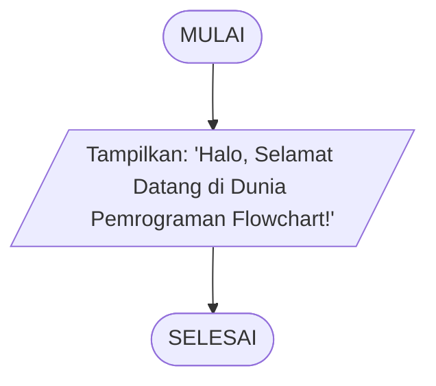
```mermaid
flowchart TD
    A([MULAI]) --> B[/Tampilkan: 'Halo, Selamat Datang di Dunia Pemrograman Flowchart!'/]
    B --> C([SELESAI])
```

#### 💻 Implementasi Kode Python 3:
```python
# Contoh 1: Menampilkan Pesan Sederhana
pesan = "Halo, Selamat Datang di Dunia Pemrograman Flowchart!"
print(pesan)
```

**🧪 Simulasi Uji Meja:**
- **Kasus Normal:** Output di layar: 'Halo, Selamat Datang di Dunia Pemrograman Flowchart!'
- **Kasus Alternatif/Batas:** Jika printer terputus, pesan tetap muncul di terminal konsol.

---

### Kasus #2: Menghitung Luas Persegi Panjang (Dasar)

**Deskripsi Kasus:** Menghitung luas bidang datar persegi panjang berdasarkan nilai panjang dan lebar yang dimasukkan oleh pengguna.

| Komponen | Keterangan |
|---|---|
| **Input** | `panjang (angka positif), lebar (angka positif).` |
| **Proses** | `luas = panjang * lebar` |
| **Output** | `Nilai luas persegi panjang.` |

#### 📐 Bagan Alir (Mermaid):
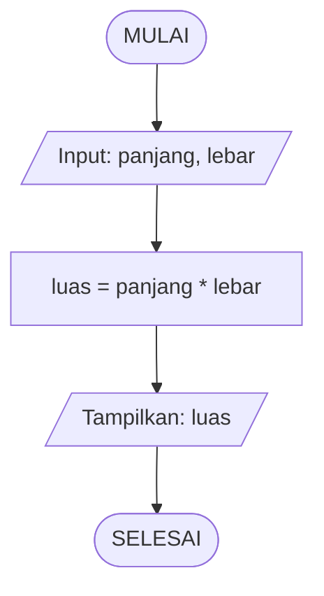
```mermaid
flowchart TD
    A([MULAI]) --> B[/Input: panjang, lebar/]
    B --> C["luas = panjang * lebar"]
    C --> D[/Tampilkan: luas/]
    D --> E([SELESAI])
```

#### 💻 Implementasi Kode Python 3:
```python
# Contoh 2: Menghitung Luas Persegi Panjang
panjang = float(input("Masukkan panjang: "))
lebar = float(input("Masukkan lebar: "))

luas = panjang * lebar
print(f"Luas Persegi Panjang adalah: {luas}")
```

**🧪 Simulasi Uji Meja:**
- **Kasus Normal:** Input: panjang=12, lebar=5 ➔ Luas: 60.0
- **Kasus Alternatif/Batas:** Input desimal: panjang=7.5, lebar=4 ➔ Luas: 30.0

---

### Kasus #3: Menghitung Rata-rata Tiga Nilai Ujian (Dasar)

**Deskripsi Kasus:** Menghitung nilai rata-rata (*mean*) dari tiga mata pelajaran (Matematika, IPA, Bahasa Indonesia).

| Komponen | Keterangan |
|---|---|
| **Input** | `nilai1, nilai2, nilai3 (skala 0 - 100).` |
| **Proses** | `rata_rata = (nilai1 + nilai2 + nilai3) / 3` |
| **Output** | `Nilai rata-rata dalam format desimal float.` |

#### 📐 Bagan Alir (Mermaid):
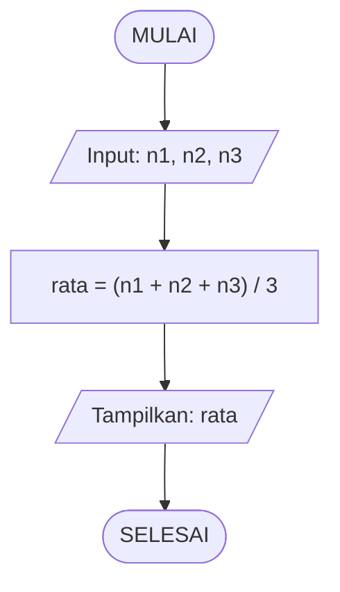
```mermaid
flowchart TD
    A([MULAI]) --> B[/Input: n1, n2, n3/]
    B --> C["rata = (n1 + n2 + n3) / 3"]
    C --> D[/Tampilkan: rata/]
    D --> E([SELESAI])
```

#### 💻 Implementasi Kode Python 3:
```python
# Contoh 3: Rata-rata 3 Nilai
n1 = 80
n2 = 90
n3 = 85

rata = (n1 + n2 + n3) / 3
print(f"Rata-rata: {rata:.2f}")
```

**🧪 Simulasi Uji Meja:**
- **Kasus Normal:** Input: 80, 90, 85 ➔ Rata-rata: 85.00
- **Kasus Alternatif/Batas:** Input: 70, 75, 80 ➔ Rata-rata: 75.00

---

### Kasus #4: Menentukan Bilangan Ganjil atau Genap (Dasar)

**Deskripsi Kasus:** Mengecek apakah sebuah bilangan bulat merupakan bilangan genap atau ganjil menggunakan operator modulo (sisa bagi).

| Komponen | Keterangan |
|---|---|
| **Input** | `bilangan (integer).` |
| **Proses** | `Cek apakah `bilangan % 2 == 0`.` |
| **Output** | `Keterangan teks 'GENAP' atau 'GANJIL'.` |

#### 📐 Bagan Alir (Mermaid):
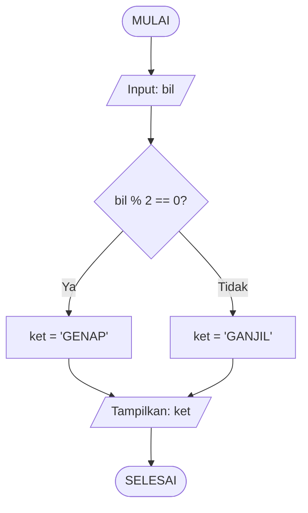
```mermaid
flowchart TD
    A([MULAI]) --> B[/Input: bil/]
    B --> C{"bil % 2 == 0?"}
    C -- Ya --> D["ket = 'GENAP'"]
    C -- Tidak --> E["ket = 'GANJIL'"]
    D --> F[/Tampilkan: ket/]
    E --> F
    F --> G([SELESAI])
```

#### 💻 Implementasi Kode Python 3:
```python
# Contoh 4: Ganjil Genap
bil = int(input("Masukkan angka: "))
if bil % 2 == 0:
    print(f"{bil} adalah bilangan GENAP")
else:
    print(f"{bil} adalah bilangan GANJIL")
```

**🧪 Simulasi Uji Meja:**
- **Kasus Normal:** Input: 18 ➔ 'GENAP'
- **Kasus Alternatif/Batas:** Input: 25 ➔ 'GANJIL'

---

### Kasus #5: Menentukan Kelulusan Berdasarkan KKM (Kriteria Ketuntasan Minimal) (Dasar)

**Deskripsi Kasus:** Siswa dinyatakan LULUS jika nilai ujian >= 75, dan REMEDIAL jika di bawah 75.

| Komponen | Keterangan |
|---|---|
| **Input** | `nama_siswa, nilai (0 - 100).` |
| **Proses** | `Evaluasi `nilai >= 75`.` |
| **Output** | `Status: 'LULUS' atau 'REMEDIAL'.` |

#### 📐 Bagan Alir (Mermaid):
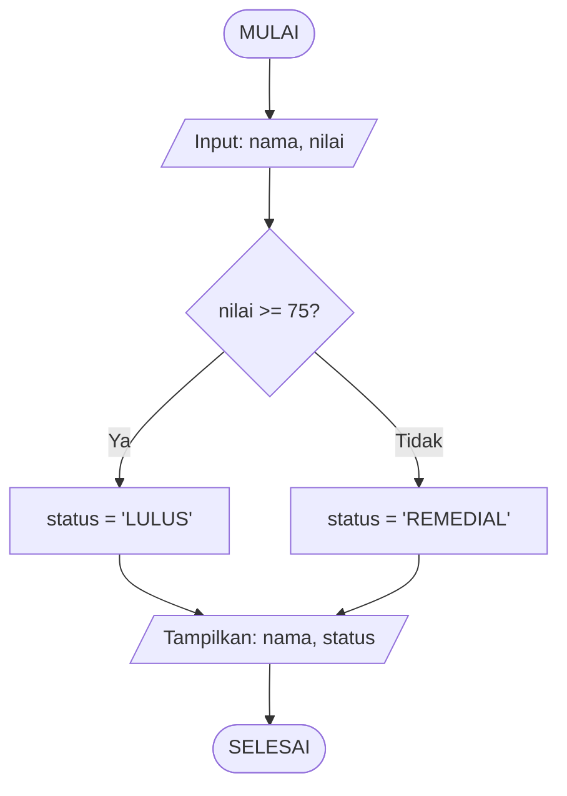
```mermaid
flowchart TD
    A([MULAI]) --> B[/Input: nama, nilai/]
    B --> C{"nilai >= 75?"}
    C -- Ya --> D["status = 'LULUS'"]
    C -- Tidak --> E["status = 'REMEDIAL'"]
    D --> F[/Tampilkan: nama, status/]
    E --> F
    F --> G([SELESAI])
```

#### 💻 Implementasi Kode Python 3:
```python
# Contoh 5: Cek Kelulusan KKM
nama = "Fajar"
nilai = 78

status = "LULUS 🎉" if nilai >= 75 else "REMEDIAL 💪"
print(f"Siswa: {nama} | Status: {status}")
```

**🧪 Simulasi Uji Meja:**
- **Kasus Normal:** Nilai 78 ➔ 'LULUS'
- **Kasus Alternatif/Batas:** Nilai 64 ➔ 'REMEDIAL'

---

### Kasus #6: Menentukan Bilangan Terbesar dari Dua Angka (Menengah)

**Deskripsi Kasus:** Menerima dua angka berbeda, lalu menentukan angka mana yang bernilai lebih besar (maksimum).

| Komponen | Keterangan |
|---|---|
| **Input** | `a, b (dua angka float atau integer).` |
| **Proses** | `Jika `a > b` maka `maks = a`, jika tidak maka `maks = b`.` |
| **Output** | `Nilai maksimum.` |

#### 📐 Bagan Alir (Mermaid):
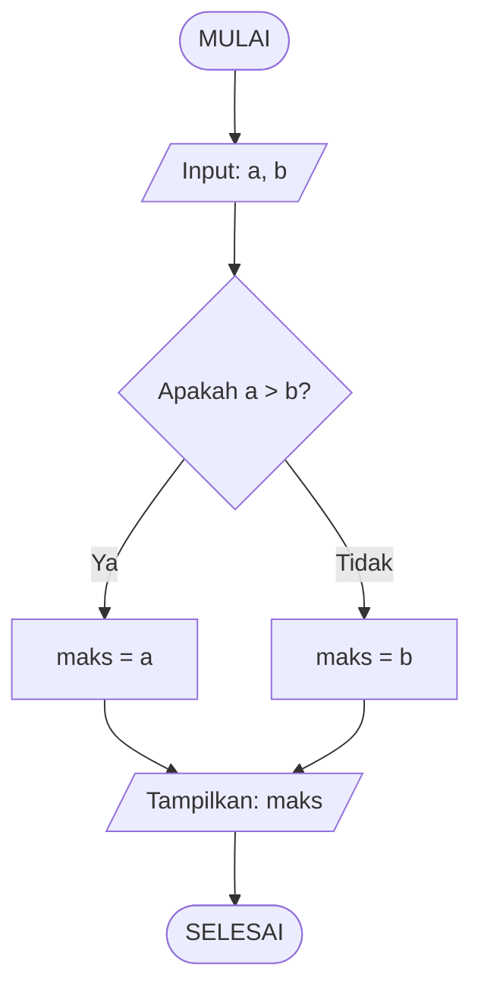
```mermaid
flowchart TD
    A([MULAI]) --> B[/Input: a, b/]
    B --> C{"Apakah a > b?"}
    C -- Ya --> D["maks = a"]
    C -- Tidak --> E["maks = b"]
    D --> F[/Tampilkan: maks/]
    E --> F
    F --> G([SELESAI])
```

#### 💻 Implementasi Kode Python 3:
```python
# Contoh 6: Maksimum 2 Angka
a = 45
b = 72

if a > b:
    maks = a
else:
    maks = b

print(f"Bilangan terbesar adalah: {maks}")
```

**🧪 Simulasi Uji Meja:**
- **Kasus Normal:** a=45, b=72 ➔ Terbesar: 72
- **Kasus Alternatif/Batas:** a=90, b=15 ➔ Terbesar: 90

---

### Kasus #7: Menentukan Bilangan Terbesar dari Tiga Angka (Menengah)

**Deskripsi Kasus:** Menerima tiga angka masukan (A, B, C) dan menentukan angka yang paling besar di antara ketiganya.

| Komponen | Keterangan |
|---|---|
| **Input** | `A, B, C (tiga angka numerik).` |
| **Proses** | `Bandingkan A dengan B dan C, lalu B dengan C.` |
| **Output** | `Angka terbesar.` |

#### 📐 Bagan Alir (Mermaid):
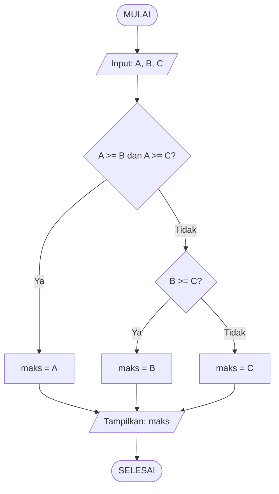
```mermaid
flowchart TD
    A([MULAI]) --> In[/Input: A, B, C/]
    In --> D1{"A >= B dan A >= C?"}
    D1 -- Ya --> SetA["maks = A"]
    D1 -- Tidak --> D2{"B >= C?"}
    D2 -- Ya --> SetB["maks = B"]
    D2 -- Tidak --> SetC["maks = C"]
    SetA --> Out[/Tampilkan: maks/]
    SetB --> Out
    SetC --> Out
    Out --> End([SELESAI])
```

#### 💻 Implementasi Kode Python 3:
```python
# Contoh 7: Terbesar dari 3 Angka
A = 34
B = 89
C = 56

if A >= B and A >= C:
    maks = A
elif B >= C:
    maks = B
else:
    maks = C

print(f"Dari {A}, {B}, dan {C}, yang terbesar adalah: {maks}")
```

**🧪 Simulasi Uji Meja:**
- **Kasus Normal:** Input: 34, 89, 56 ➔ Terbesar: 89
- **Kasus Alternatif/Batas:** Input: 100, 10, 50 ➔ Terbesar: 100

---

### Kasus #8: Menghitung Diskon Belanja Supermarket (Menengah)

**Deskripsi Kasus:** Supermarket memberikan promo diskon 15% jika total belanja minimal Rp 200.000, jika tidak maka tidak ada diskon.

| Komponen | Keterangan |
|---|---|
| **Input** | `total_belanja (angka rupiah).` |
| **Proses** | `Jika belanja >= 200000, diskon = 0.15 * belanja, selain itu diskon = 0.` |
| **Output** | `Besar diskon dan total yang harus dibayar.` |

#### 📐 Bagan Alir (Mermaid):
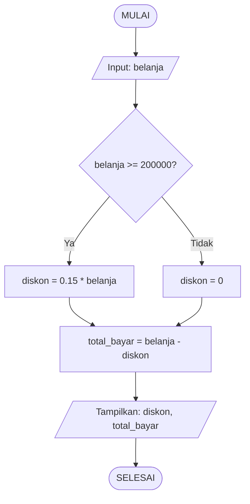
```mermaid
flowchart TD
    Start([MULAI]) --> In[/Input: belanja/]
    In --> Cond{"belanja >= 200000?"}
    Cond -- Ya --> Disc["diskon = 0.15 * belanja"]
    Cond -- Tidak --> NoDisc["diskon = 0"]
    Disc --> Calc["total_bayar = belanja - diskon"]
    NoDisc --> Calc
    Calc --> Out[/Tampilkan: diskon, total_bayar/]
    Out --> Finish([SELESAI])
```

#### 💻 Implementasi Kode Python 3:
```python
# Contoh 8: Diskon Supermarket
belanja = 250000

if belanja >= 200000:
    diskon = 0.15 * belanja
else:
    diskon = 0

total_bayar = belanja - diskon
print(f"Belanja: Rp {belanja:,} | Diskon: Rp {int(diskon):,} | Bayar: Rp {int(total_bayar):,}")
```

**🧪 Simulasi Uji Meja:**
- **Kasus Normal:** Belanja 250.000 ➔ Diskon: 37.500, Bayar: 212.500
- **Kasus Alternatif/Batas:** Belanja 150.000 ➔ Diskon: 0, Bayar: 150.000

---

### Kasus #9: Menghitung Total Pembayaran Kasir Restoran (Termasuk Pajak & Kembalian) (Menengah)

**Deskripsi Kasus:** Program kasir menghitung subtotal pesanan, menambahkan PPN 11%, menerima uang bayar dari pelanggan, dan menghitung uang kembalian.

| Komponen | Keterangan |
|---|---|
| **Input** | `subtotal, uang_diterima (angka rupiah).` |
| **Proses** | `pajak = 0.11 * subtotal; total_tagihan = subtotal + pajak; kembalian = uang_diterima - total_tagihan.` |
| **Output** | `pajak, total_tagihan, kembalian (atau pesan kurang bayar).` |

#### 📐 Bagan Alir (Mermaid):
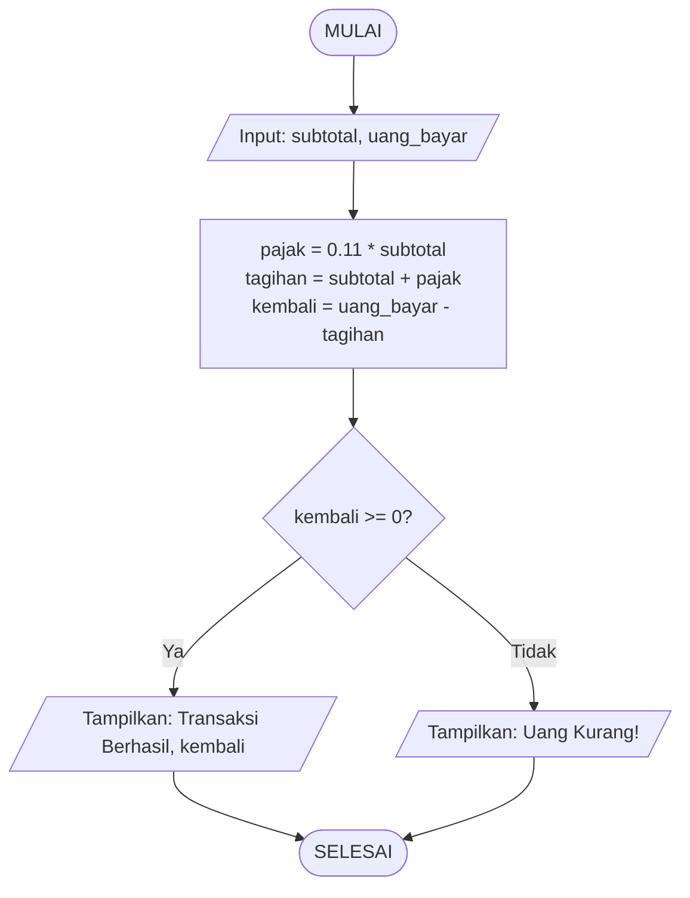
```mermaid
flowchart TD
    A([MULAI]) --> B[/Input: subtotal, uang_bayar/]
    B --> C["pajak = 0.11 * subtotal<br>tagihan = subtotal + pajak<br>kembali = uang_bayar - tagihan"]
    C --> D{"kembali >= 0?"}
    D -- Ya --> E[/Tampilkan: Transaksi Berhasil, kembali/]
    D -- Tidak --> F[/Tampilkan: Uang Kurang!/]
    E --> G([SELESAI])
    F --> G
```

#### 💻 Implementasi Kode Python 3:
```python
# Contoh 9: Kasir Restoran
subtotal = 100000
uang_bayar = 150000

pajak = 0.11 * subtotal
tagihan = subtotal + pajak
kembali = uang_bayar - tagihan

if kembali >= 0:
    print(f"Tagihan: Rp {int(tagihan):,} | Kembali: Rp {int(kembali):,}")
else:
    print(f"Uang kurang Rp {int(abs(kembali)):,}")
```

**🧪 Simulasi Uji Meja:**
- **Kasus Normal:** Subtotal 100rb, Uang 150rb ➔ Tagihan 111rb, Kembali 39rb
- **Kasus Alternatif/Batas:** Subtotal 100rb, Uang 100rb ➔ Uang kurang Rp 11.000

---

### Kasus #10: Memeriksa Login Sederhana (Username & Password) (Menengah)

**Deskripsi Kasus:** Memeriksa validitas kredensial pengguna yang mencoba masuk ke dalam sistem.

| Komponen | Keterangan |
|---|---|
| **Input** | `input_user, input_pass (string).` |
| **Proses** | `Cek apakah `input_user == 'admin'` DAN `input_pass == 'rahasia123'`.` |
| **Output** | `'Login Berhasil' atau 'Username / Password Salah!'.` |

#### 📐 Bagan Alir (Mermaid):
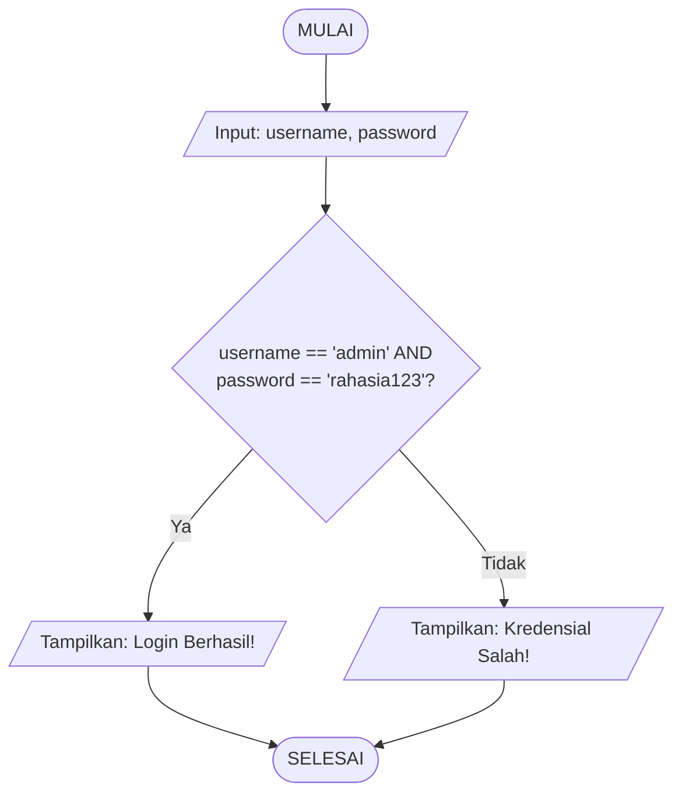
```mermaid
flowchart TD
    A([MULAI]) --> B[/Input: username, password/]
    B --> C{"username == 'admin' AND<br>password == 'rahasia123'?"}
    C -- Ya --> D[/Tampilkan: Login Berhasil!/]
    C -- Tidak --> E[/Tampilkan: Kredensial Salah!/]
    D --> F([SELESAI])
    E --> F
```

#### 💻 Implementasi Kode Python 3:
```python
# Contoh 10: Login Sederhana
username = "admin"
password = "wrongpassword"

if username == "admin" and password == "rahasia123":
    print("✅ Login Berhasil!")
else:
    print("❌ Akses Ditolak: Kredensial Tidak Cocok!")
```

**🧪 Simulasi Uji Meja:**
- **Kasus Normal:** Input: admin / rahasia123 ➔ 'Login Berhasil!'
- **Kasus Alternatif/Batas:** Input: admin / 12345 ➔ 'Akses Ditolak'

---

### Kasus #11: Menampilkan Angka 1 Sampai N Menggunakan Perulangan (Menengah)

**Deskripsi Kasus:** Mencetak deret angka bulat mulai dari 1 sampai batas N yang ditentukan pengguna.

| Komponen | Keterangan |
|---|---|
| **Input** | `N (bilangan bulat positif).` |
| **Proses** | `Inisialisasi `i = 1`. Ulangi cetak `i` dan `i = i + 1` selama `i <= N`.` |
| **Output** | `Deret angka 1, 2, 3, ..., N.` |

#### 📐 Bagan Alir (Mermaid):
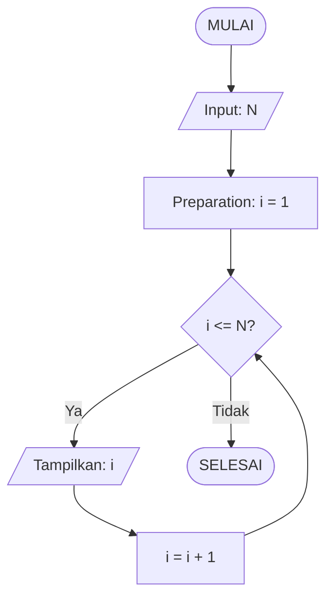
```mermaid
flowchart TD
    A([MULAI]) --> B[/Input: N/]
    B --> C["Preparation: i = 1"]
    C --> D{"i <= N?"}
    D -- Ya --> E[/Tampilkan: i/]
    E --> F["i = i + 1"]
    F --> D
    D -- Tidak --> G([SELESAI])
```

#### 💻 Implementasi Kode Python 3:
```python
# Contoh 11: Cetak Angka 1 sampai N
N = 5
i = 1

while i <= N:
    print(f"Angka: {i}")
    i += 1
```

**🧪 Simulasi Uji Meja:**
- **Kasus Normal:** N = 5 ➔ Mencetak: 1, 2, 3, 4, 5
- **Kasus Alternatif/Batas:** N = 0 ➔ Tidak mencetak angka apapun langsung selesai.

---

### Kasus #12: Menghitung Nilai Faktorial (n!) (Lanjutan)

**Deskripsi Kasus:** Menghitung hasil perkalian beruntun faktorial n! = 1 * 2 * 3 * ... * n.

| Komponen | Keterangan |
|---|---|
| **Input** | `n (integer non-negatif).` |
| **Proses** | `Inisialisasi `faktorial = 1, i = 1`. Selama `i <= n`, `faktorial = faktorial * i`, `i = i + 1`.` |
| **Output** | `Nilai hasil n!.` |

#### 📐 Bagan Alir (Mermaid):
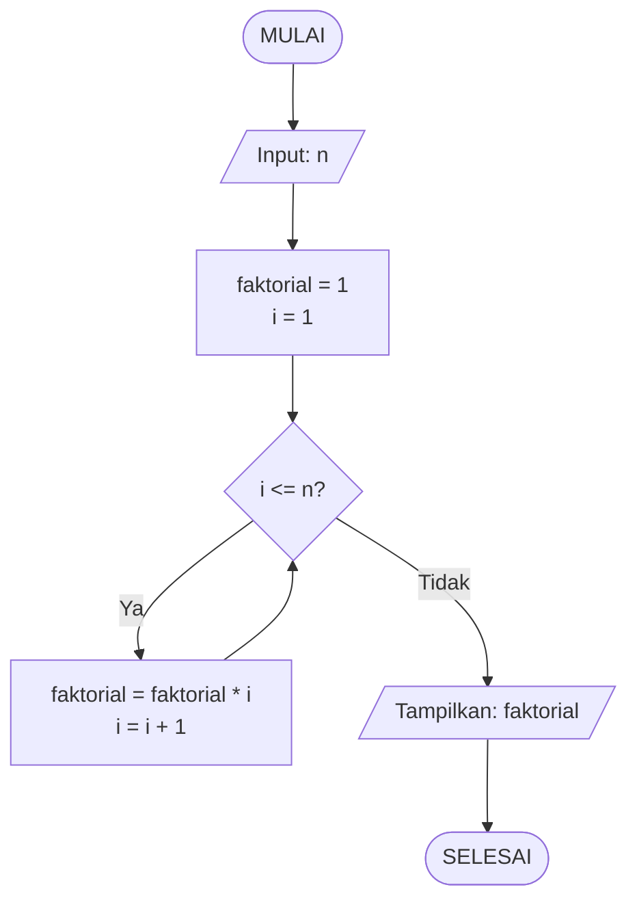
```mermaid
flowchart TD
    A([MULAI]) --> B[/Input: n/]
    B --> C["faktorial = 1<br>i = 1"]
    C --> D{"i <= n?"}
    D -- Ya --> E["faktorial = faktorial * i<br>i = i + 1"]
    E --> D
    D -- Tidak --> F[/Tampilkan: faktorial/]
    F --> G([SELESAI])
```

#### 💻 Implementasi Kode Python 3:
```python
# Contoh 12: Faktorial
n = 5
faktorial = 1
for i in range(1, n + 1):
    faktorial *= i

print(f"{n}! = {faktorial}")
```

**🧪 Simulasi Uji Meja:**
- **Kasus Normal:** n = 5 ➔ 5! = 120
- **Kasus Alternatif/Batas:** n = 0 ➔ 0! = 1

---

### Kasus #13: Menghitung Jumlah Deret Bilangan (1 + 2 + ... + n) (Lanjutan)

**Deskripsi Kasus:** Menghitung total jumlahan aritmatika dari bilangan 1 sampai n.

| Komponen | Keterangan |
|---|---|
| **Input** | `n (integer positif).` |
| **Proses** | `total = 0; loop i dari 1 sampai n: total = total + i.` |
| **Output** | `Total jumlahan deret.` |

#### 📐 Bagan Alir (Mermaid):
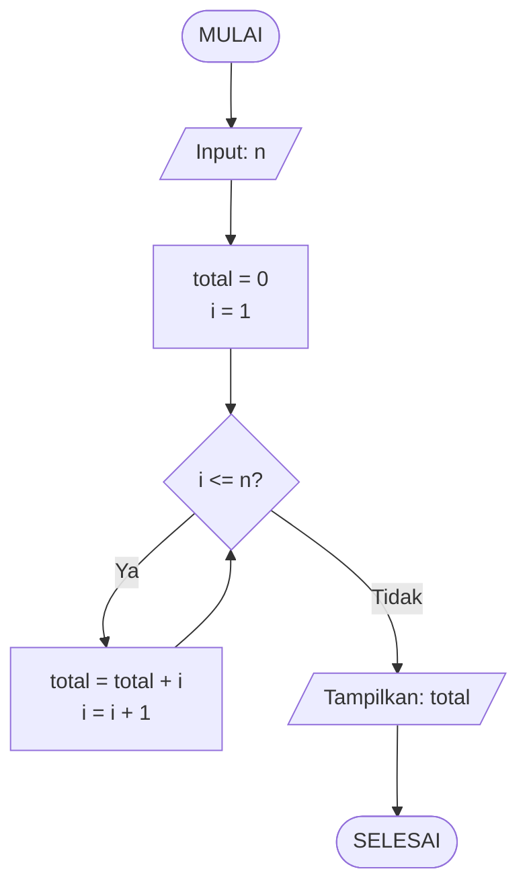
```mermaid
flowchart TD
    A([MULAI]) --> B[/Input: n/]
    B --> C["total = 0<br>i = 1"]
    C --> D{"i <= n?"}
    D -- Ya --> E["total = total + i<br>i = i + 1"]
    E --> D
    D -- Tidak --> F[/Tampilkan: total/]
    F --> G([SELESAI])
```

#### 💻 Implementasi Kode Python 3:
```python
# Contoh 13: Jumlah Deret
n = 10
total = sum(range(1, n + 1))
print(f"Jumlah deret 1 s.d. {n} adalah: {total}")
```

**🧪 Simulasi Uji Meja:**
- **Kasus Normal:** n = 10 ➔ Total: 55
- **Kasus Alternatif/Batas:** n = 100 ➔ Total: 5050

---

### Kasus #14: Menentukan Kategori Grade Nilai (A, B, C, D, E) (Lanjutan)

**Deskripsi Kasus:** Mengonversi nilai numerik siswa (0 - 100) menjadi huruf mutu akademik standar universitas.

| Komponen | Keterangan |
|---|---|
| **Input** | `nilai (0 - 100).` |
| **Proses** | `>=85 (A), >=70 (B), >=60 (C), >=50 (D), selain itu (E).` |
| **Output** | `Grade huruf dan bobot.` |

#### 📐 Bagan Alir (Mermaid):
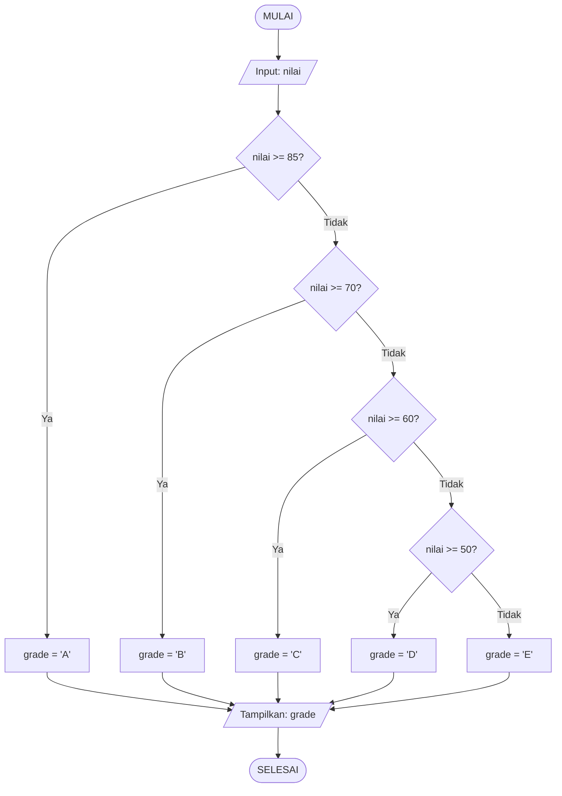
```mermaid
flowchart TD
    A([MULAI]) --> B[/Input: nilai/]
    B --> C{"nilai >= 85?"}
    C -- Ya --> A1["grade = 'A'"]
    C -- Tidak --> D{"nilai >= 70?"}
    D -- Ya --> B1["grade = 'B'"]
    D -- Tidak --> E{"nilai >= 60?"}
    E -- Ya --> C1["grade = 'C'"]
    E -- Tidak --> F{"nilai >= 50?"}
    F -- Ya --> D1["grade = 'D'"]
    F -- Tidak --> E1["grade = 'E'"]
    A1 --> Out[/Tampilkan: grade/]
    B1 --> Out
    C1 --> Out
    D1 --> Out
    E1 --> Out
    Out --> Fin([SELESAI])
```

#### 💻 Implementasi Kode Python 3:
```python
# Contoh 14: Konversi Grade
nilai = 74

if nilai >= 85: grade = 'A'
elif nilai >= 70: grade = 'B'
elif nilai >= 60: grade = 'C'
elif nilai >= 50: grade = 'D'
else: grade = 'E'

print(f"Nilai: {nilai} ➔ Grade: {grade}")
```

**🧪 Simulasi Uji Meja:**
- **Kasus Normal:** Nilai: 74 ➔ Grade: B
- **Kasus Alternatif/Batas:** Nilai: 42 ➔ Grade: E

---

### Kasus #15: Simulasi Mesin ATM Sederhana (Cek PIN, Saldo, & Tarik Tunai) (Lanjutan)

**Deskripsi Kasus:** Simulasi alur transaksi mesin anjungan tunai mandiri: verifikasi PIN, cek kecukupan saldo terhadap nominal penarikan, pemotongan saldo, dan pengeluaran uang fisik.

| Komponen | Keterangan |
|---|---|
| **Input** | `pin_input, jumlah_tarik.` |
| **Proses** | `Cek pin == pin_rahasia. Jika valid, cek saldo >= jumlah_tarik. Jika cukup, kurangi saldo.` |
| **Output** | `Uang tunai keluar atau pesan kegagalan (PIN salah / Saldo tidak cukup).` |

#### 📐 Bagan Alir (Mermaid):
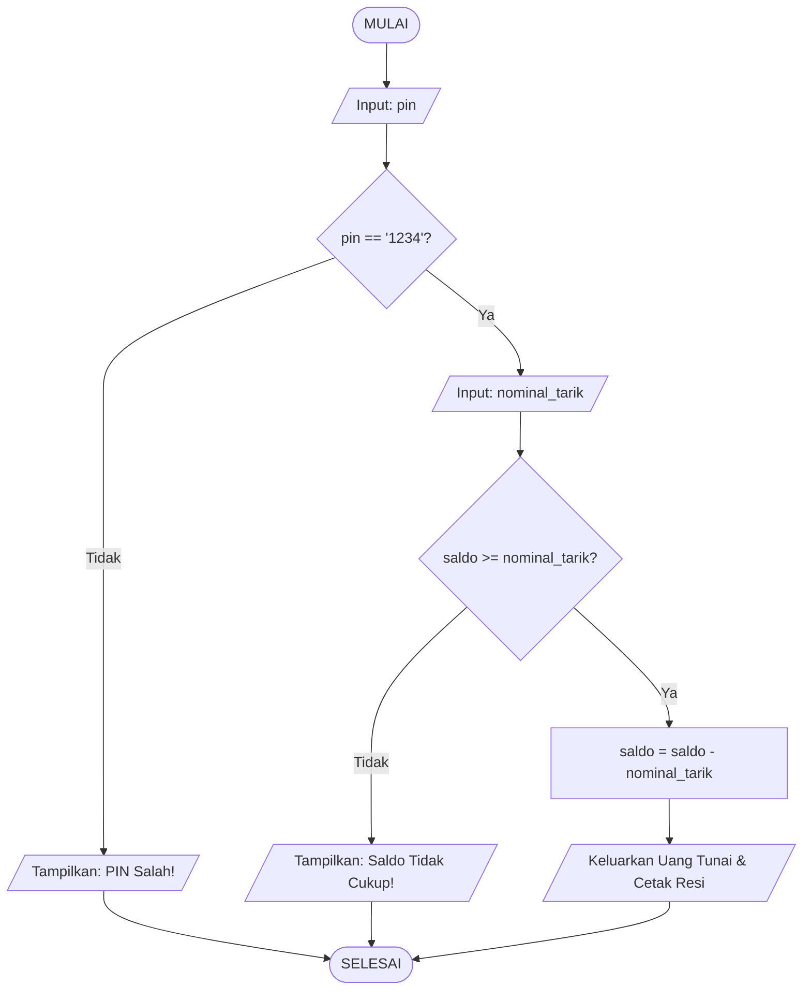
```mermaid
flowchart TD
    A([MULAI]) --> B[/Input: pin/]
    B --> C{"pin == '1234'?"}
    C -- Tidak --> D[/Tampilkan: PIN Salah!/]
    C -- Ya --> E[/Input: nominal_tarik/]
    E --> F{"saldo >= nominal_tarik?"}
    F -- Tidak --> G[/Tampilkan: Saldo Tidak Cukup!/]
    F -- Ya --> H["saldo = saldo - nominal_tarik"]
    H --> I[/Keluarkan Uang Tunai & Cetak Resi/]
    D --> Fin([SELESAI])
    G --> Fin
    I --> Fin
```

#### 💻 Implementasi Kode Python 3:
```python
# Contoh 15: Simulasi ATM
saldo = 1000000
pin_terdaftar = "1234"

pin_masuk = "1234"
if pin_masuk == pin_terdaftar:
    tarik = 300000
    if saldo >= tarik:
        saldo -= tarik
        print(f"💵 Tarik tunai Rp {tarik:,} berhasil. Sisa saldo: Rp {saldo:,}")
    else:
        print("❌ Saldo tidak cukup!")
else:
    print("❌ PIN Salah!")
```

**🧪 Simulasi Uji Meja:**
- **Kasus Normal:** PIN '1234', Tarik 300rb ➔ Sukses, Saldo sisa 700rb
- **Kasus Alternatif/Batas:** PIN '1234', Tarik 1.5jt ➔ Gagal: Saldo tidak cukup

---

### Kasus #16: Proses Peminjaman Buku Perpustakaan Digital (Lanjutan)

**Deskripsi Kasus:** Siswa meminjam buku di perpustakaan sekolah. Sistem memeriksa apakah kartu aktif, buku tersedia, dan apakah siswa masih memiliki tunggakan denda buku lama.

| Komponen | Keterangan |
|---|---|
| **Input** | `id_anggota, id_buku.` |
| **Proses** | `Validasi status keanggotaan ➔ Cek denda tertunggak ➔ Cek stok buku di database ➔ Buat tiket peminjaman.` |
| **Output** | `Buku berhasil dipinjam (cetak tanggal kembali) atau penolakan dengan alasan.` |

#### 📐 Bagan Alir (Mermaid):
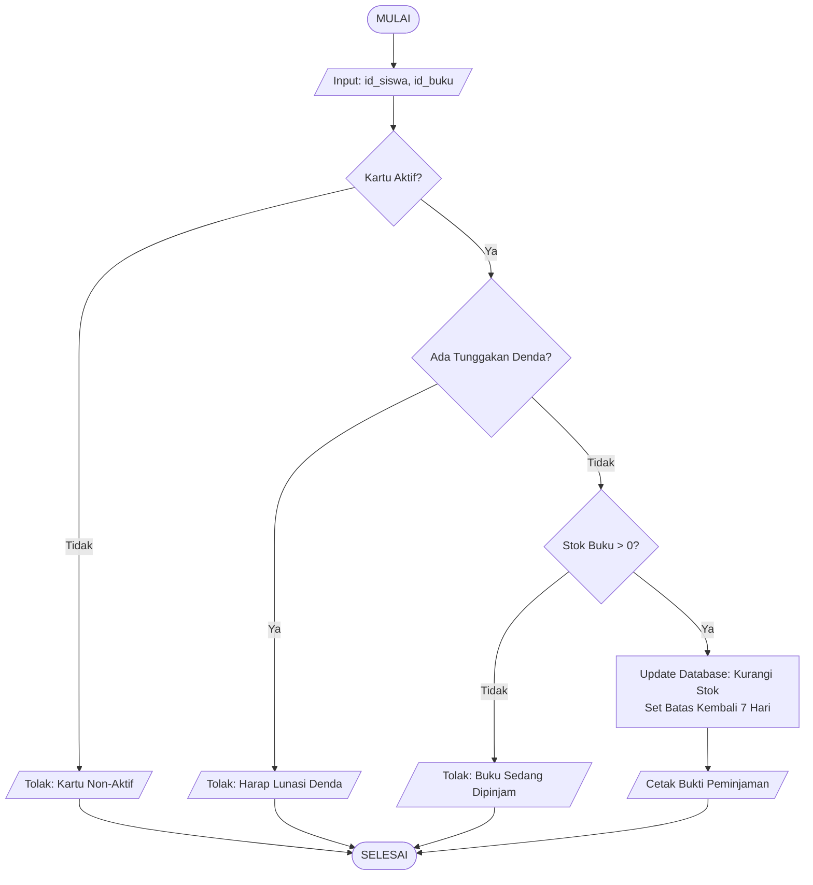
```mermaid
flowchart TD
    S([MULAI]) --> In[/Input: id_siswa, id_buku/]
    In --> C1{"Kartu Aktif?"}
    C1 -- Tidak --> R1[/Tolak: Kartu Non-Aktif/]
    C1 -- Ya --> C2{"Ada Tunggakan Denda?"}
    C2 -- Ya --> R2[/Tolak: Harap Lunasi Denda/]
    C2 -- Tidak --> C3{"Stok Buku > 0?"}
    C3 -- Tidak --> R3[/Tolak: Buku Sedang Dipinjam/]
    C3 -- Ya --> OK["Update Database: Kurangi Stok<br>Set Batas Kembali 7 Hari"]
    OK --> Pr[/Cetak Bukti Peminjaman/]
    R1 --> E([SELESAI])
    R2 --> E
    R3 --> E
    Pr --> E
```

#### 💻 Implementasi Kode Python 3:
```python
# Contoh 16: Peminjaman Buku
kartu_aktif = True
denda = 0
stok = 2

if not kartu_aktif:
    print("❌ Kartu non-aktif")
elif denda > 0:
    print(f"❌ Lunasi denda Rp {denda:,}")
elif stok <= 0:
    print("❌ Stok buku habis")
else:
    stok -= 1
    print("✅ Peminjaman berhasil! Batas kembali: 7 hari dari sekarang.")
```

**🧪 Simulasi Uji Meja:**
- **Kasus Normal:** Kartu aktif, denda 0, stok 2 ➔ Peminjaman Berhasil
- **Kasus Alternatif/Batas:** Kartu aktif, denda 5000 ➔ Ditolak karena denda

---

### Kasus #17: Proses Registrasi Akun Pengguna Digital (Validasi Password Kuat) (Lanjutan)

**Deskripsi Kasus:** Alur pendaftaran akun pengguna baru dengan verifikasi kelayakan kata sandi (minimal 8 karakter dan mengandung angka).

| Komponen | Keterangan |
|---|---|
| **Input** | `email, password, konfirmasi_password.` |
| **Proses** | `Cek format email ➔ Cek panjang password >= 8 ➔ Cek password == konfirmasi_password ➔ Cek email belum terdaftar di database.` |
| **Output** | `Pesan 'Registrasi Berhasil! Cek Email Aktivasi' atau pesan kesalahan spesifik.` |

#### 📐 Bagan Alir (Mermaid):
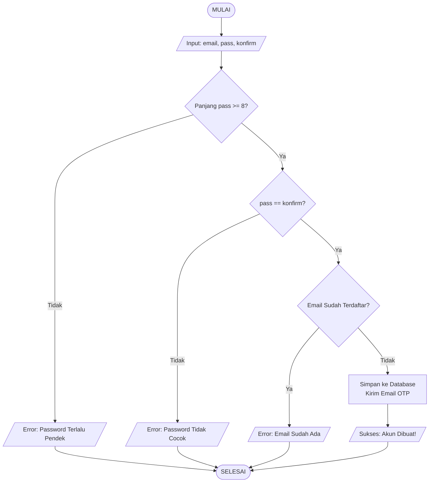
```mermaid
flowchart TD
    S([MULAI]) --> In[/Input: email, pass, konfirm/]
    In --> C1{"Panjang pass >= 8?"}
    C1 -- Tidak --> E1[/Error: Password Terlalu Pendek/]
    C1 -- Ya --> C2{"pass == konfirm?"}
    C2 -- Tidak --> E2[/Error: Password Tidak Cocok/]
    C2 -- Ya --> C3{"Email Sudah Terdaftar?"}
    C3 -- Ya --> E3[/Error: Email Sudah Ada/]
    C3 -- Tidak --> Save["Simpan ke Database<br>Kirim Email OTP"]
    Save --> Out[/Sukses: Akun Dibuat!/]
    E1 --> Fin([SELESAI])
    E2 --> Fin
    E3 --> Fin
    Out --> Fin
```

#### 💻 Implementasi Kode Python 3:
```python
# Contoh 17: Registrasi Akun
email = "budi@sekolah.id"
password = "Password123"
konfirmasi = "Password123"
db_emails = ["ani@sekolah.id", "citra@sekolah.id"]

if len(password) < 8:
    print("❌ Password minimal 8 karakter!")
elif password != konfirmasi:
    print("❌ Konfirmasi password tidak cocok!")
elif email in db_emails:
    print("❌ Email sudah terdaftar!")
else:
    db_emails.append(email)
    print(f"✅ Registrasi sukses untuk {email}!")
```

**🧪 Simulasi Uji Meja:**
- **Kasus Normal:** Data valid ➔ Registrasi sukses
- **Kasus Alternatif/Batas:** Password 5 huruf ➔ Ditolak karena < 8 karakter

---

### Kasus #18: Pengolahan Data Nilai Mahasiswa & Perhitungan IPK Semester (Lanjutan)

**Deskripsi Kasus:** Menghitung Indeks Prestasi Semester (IPS/IPK) mahasiswa berdasarkan sejumlah mata kuliah dengan bobot SKS berbeda.

| Komponen | Keterangan |
|---|---|
| **Input** | `Daftar mata kuliah (nilai_huruf, sks).` |
| **Proses** | `Konversi nilai huruf ke angka bobot (A=4, B=3, C=2, D=1, E=0). Akumulasi `total_mutu += bobot * sks` dan `total_sks += sks`. Hitung `IPK = total_mutu / total_sks`.` |
| **Output** | `Total SKS, Total Mutu, dan Nilai IPK.` |

#### 📐 Bagan Alir (Mermaid):
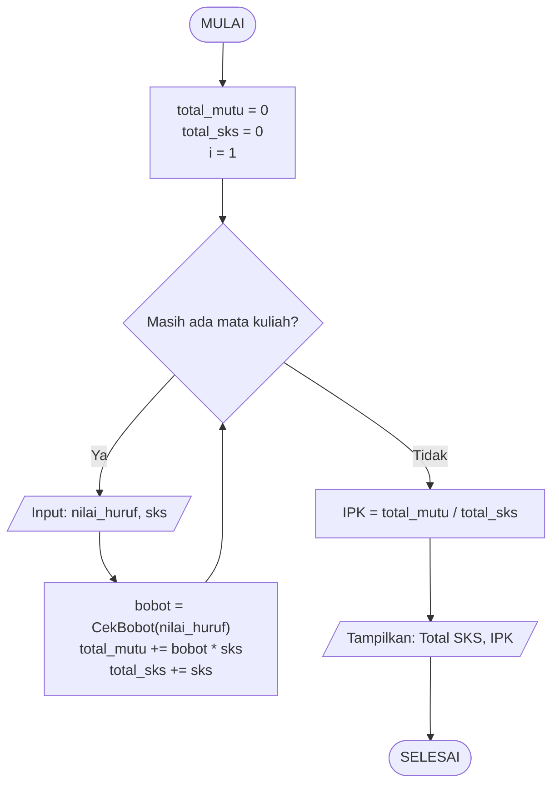
```mermaid
flowchart TD
    S([MULAI]) --> Init["total_mutu = 0<br>total_sks = 0<br>i = 1"]
    Init --> Check{"Masih ada mata kuliah?"}
    Check -- Ya --> Read[/Input: nilai_huruf, sks/]
    Read --> Calc["bobot = CekBobot(nilai_huruf)<br>total_mutu += bobot * sks<br>total_sks += sks"]
    Calc --> Check
    Check -- Tidak --> FinCalc["IPK = total_mutu / total_sks"]
    FinCalc --> Out[/Tampilkan: Total SKS, IPK/]
    Out --> E([SELESAI])
```

#### 💻 Implementasi Kode Python 3:
```python
# Contoh 18: Perhitungan IPK
matkul = [
    {"nama": "Algoritma", "huruf": "A", "sks": 3},  # Bobot 4
    {"nama": "Matematika", "huruf": "B", "sks": 3}, # Bobot 3
    {"nama": "Basis Data", "huruf": "A", "sks": 4}  # Bobot 4
]

bobot_map = {"A": 4.0, "B": 3.0, "C": 2.0, "D": 1.0, "E": 0.0}
total_mutu = sum(bobot_map[m["huruf"]] * m["sks"] for m in matkul)
total_sks = sum(m["sks"] for m in matkul)
ipk = total_mutu / total_sks

print(f"Total SKS: {total_sks} | Total Mutu: {total_mutu} | IPK: {ipk:.2f}")
```

**🧪 Simulasi Uji Meja:**
- **Kasus Normal:** Mata kuliah di atas ➔ IPK: 3.70
- **Kasus Alternatif/Batas:** Semua mata kuliah bernilai A ➔ IPK: 4.00

---

### Kasus #19: Alur Sistem Pengaduan Aspirasi Layanan Publik / Sekolah (Lanjutan)

**Deskripsi Kasus:** Alur penanganan tiket laporan pengaduan dari siswa/warga: pelaporan ➔ verifikasi admin ➔ disposisi ke divisi terkait ➔ tindak lanjut ➔ penutupan tiket.

| Komponen | Keterangan |
|---|---|
| **Input** | `tiket_laporan (kategori, deskripsi, lampiran).` |
| **Proses** | `Verifikasi validitas ➔ Disposisi departemen ➔ Investigasi ➔ Penyelesaian.` |
| **Output** | `Notifikasi berkala status tiket (Diajukan ➔ Diproses ➔ Selesai).` |

#### 📐 Bagan Alir (Mermaid):
```mermaid
flowchart TD
    S([MULAI]) --> Sub[/Warga Input Laporan Pengaduan/]
    Sub --> V{"Verifikasi Bukti Valid?"}
    V -- Tidak --> R[/Status: DITOLAK (Beri Alasan)/]
    V -- Ya --> T[Terbitkan No Tiket]
    T --> D[Disposisi ke Divisi Terkait]
    D --> Fix[Petugas Menindaklanjuti Lapangan]
    Fix --> Done[Upload Foto Bukti Perbaikan]
    Done --> Notif[/Status: SELESAI & Kirim Notif/]
    R --> E([SELESAI])
    Notif --> E
```

#### 💻 Implementasi Kode Python 3:
```python
# Contoh 19: Pengaduan Layanan
tiket = {"id": "ADU-101", "judul": "AC Lab Rusak", "valid": True}

if not tiket["valid"]:
    tiket["status"] = "Ditolak"
else:
    tiket["status"] = "Dalam Pengerjaan"
    # Simulasi selesai dikerjakan teknisi
    tiket["status"] = "Selesai"

print(f"Tiket: {tiket['id']} | Judul: {tiket['judul']} | Status Akhir: {tiket['status']}")
```

**🧪 Simulasi Uji Meja:**
- **Kasus Normal:** Laporan valid ➔ Tiket terselesaikan
- **Kasus Alternatif/Batas:** Laporan fiktif ➔ Tiket ditolak

---

### Kasus #20: Proses Bisnis Pemesanan Produk E-Commerce (Checkout hingga Pengiriman) (Lanjutan)

**Deskripsi Kasus:** Alur transaksi menyeluruh pada toko online: cek keranjang belanja, pemilihan kurir logistik, pembayaran ke payment gateway, pemotongan stok gudang, dan penyerahan paket ke kurir.

| Komponen | Keterangan |
|---|---|
| **Input** | `keranjang_belanja, metode_pembayaran, alamat_kirim.` |
| **Proses** | `Reservasi stok ➔ Integrasi payment gateway ➔ Cek status lunas ➔ Cetak resi gudang ➔ Serah terima kurir.` |
| **Output** | `Pesanan terkirim dengan nomor resi pelacakan ekspedisi.` |

#### 📐 Bagan Alir (Mermaid):
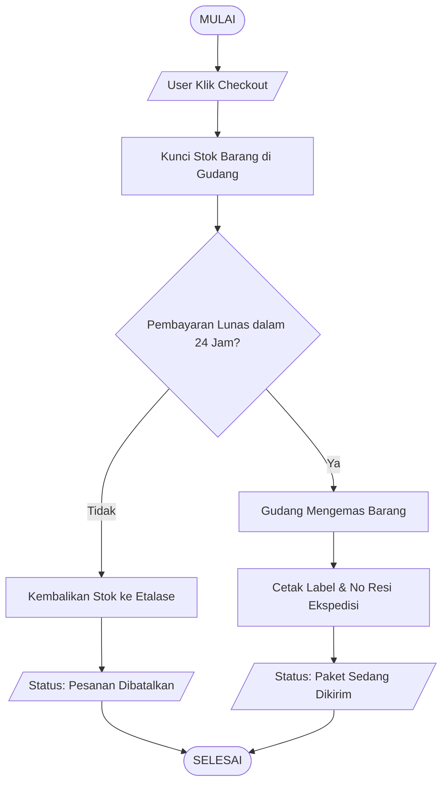
```mermaid
flowchart TD
    S([MULAI]) --> In[/User Klik Checkout/]
    In --> Lock[Kunci Stok Barang di Gudang]
    Lock --> Pay{"Pembayaran Lunas dalam 24 Jam?"}
    Pay -- Tidak --> Exp[Kembalikan Stok ke Etalase]
    Exp --> Cancel[/Status: Pesanan Dibatalkan/]
    Pay -- Ya --> Pack[Gudang Mengemas Barang]
    Pack --> Resi[Cetak Label & No Resi Ekspedisi]
    Resi --> Ship[/Status: Paket Sedang Dikirim/]
    Cancel --> E([SELESAI])
    Ship --> E
```

#### 💻 Implementasi Kode Python 3:
```python
# Contoh 20: Alur E-Commerce
stok_barang = 5
pembayaran_sukses = True

if stok_barang > 0:
    stok_barang -= 1  # Kunci stok
    if pembayaran_sukses:
        resi = "JNE-99887766"
        status = f"Paket Dikemas & Dikirim. Resi: {resi}"
    else:
        stok_barang += 1  # Rollback
        status = "Pembayaran Kadaluarsa, Pesanan Batal"
else:
    status = "Gagal: Stok Habis"

print(status)
```

**🧪 Simulasi Uji Meja:**
- **Kasus Normal:** Pembayaran lunas ➔ Paket dikirim dengan nomor resi pelacakan
- **Kasus Alternatif/Batas:** Pembayaran timeout 24 jam ➔ Stok dikembalikan otomatis

---


---

<a id='bab8'></a>
# BAB VIII — TOOLS PEMBUATAN FLOWCHART

> *Panduan Aplikasi Web, Desktop, Office Suite, dan Text-to-Diagram (Mermaid.js)*

### 🎯 Tujuan Pembelajaran:
- Mengenal 4 kategori alat bantu pembuatan flowchart modern.
- Memilih software yang paling tepat sesuai kebutuhan proyek, anggaran, dan kolaborasi tim.
- Menguasai sintaks teks Mermaid.js untuk membuat diagram alir instan tanpa drag-and-drop.
- Memahami kelebihan dan batasan dari masing-masing alat.


## 8.1 Empat Kategori Perangkat Lunak Flowchart

<p>Dalam era digital modern, pembuatan flowchart tidak lagi menggunakan penggaris dan pensil di atas kertas kalkir. Terdapat empat kategori utama software yang dapat Anda gunakan:</p>
                
                
                    
                        Kategori 1
                        <h4>🌐 Editor Berbasis Web (Cloud-Based)</h4>
                        <p>Dijalankan langsung di peramban (browser) tanpa instalasi. Sangat unggul untuk kolaborasi tim secara real-time.</p>
                        <ul>
                            <li><strong>Draw.io (diagrams.net):</strong> 100% Gratis, open-source, terintegrasi dengan Google Drive, OneDrive, GitHub. URL: <a href="https://app.diagrams.net" target="_blank" rel="noopener">app.diagrams.net</a></li>
                            <li><strong>Lucidchart:</strong> Standar industri enterprise, template sangat melimpah, integrasi Atlassian Jira & Confluence. URL: <a href="https://www.lucidchart.com" target="_blank" rel="noopener">lucidchart.com</a></li>
                            <li><strong>Miro:</strong> Kanvas kolaborasi visual tak terbatas (*infinite canvas*) untuk brainstorming tim. URL: <a href="https://miro.com" target="_blank" rel="noopener">miro.com</a></li>
                        </ul>
                    

                    
                        Kategori 2
                        <h4>💻 Aplikasi Desktop (Offline Native)</h4>
                        <p>Diinstal langsung di sistem operasi (Windows/macOS/Linux). Bekerja cepat tanpa memerlukan koneksi internet.</p>
                        <ul>
                            <li><strong>Microsoft Visio:</strong> Standar de-facto korporat dengan ribuan stensil resmi standar ANSI, ISO, UML, dan BPMN. URL: <a href="https://www.microsoft.com/en-us/microsoft-365/visio" target="_blank" rel="noopener">microsoft.com/visio</a></li>
                            <li><strong>EdrawMax:</strong> Perangkat lunak serbaguna kaya fitur grafis dengan ekspor ke berbagai format vektor. URL: <a href="https://www.edrawsoft.com/edraw-max/" target="_blank" rel="noopener">edrawsoft.com/edraw-max</a></li>
                            <li><strong>Dia Diagram Editor:</strong> Software open-source legendaris yang sangat ringan untuk Linux dan Windows. URL: <a href="http://dia-installer.de/" target="_blank" rel="noopener">dia-installer.de</a></li>
                        </ul>
                    

                    
                        Kategori 3
                        <h4>📑 Fitur Diagram pada Aplikasi Perkantoran</h4>
                        <p>Menggunakan fitur bawaan pengolah kata dan presentasi untuk dokumen laporan formal.</p>
                        <ul>
                            <li><strong>Microsoft Word & PowerPoint:</strong> Menu <code>Insert ➔ Shapes ➔ Flowchart</code> atau menggunakan fitur <code>SmartArt</code>. Sangat praktis untuk makalah tugas sekolah tanpa software tambahan.</li>
                            <li><strong>Google Docs & Slides:</strong> Menu <code>Sisipkan ➔ Gambar ➔ Baru</code>. Memungkinkan pengeditan langsung bersama rekan kelompok di Google Workspace.</li>
                        </ul>
                    

                    
                        Kategori 4
                        <h4>⚡ Text-to-Diagram Tools (Diagram as Code)</h4>
                        <p>Membuat diagram menggunakan baris sintaks teks sederhana yang otomatis dirender menjadi diagram grafis.</p>
                        <ul>
                            <li><strong>Mermaid.js:</strong> Sintaks berbasis teks yang didukung secara *native* oleh GitHub, GitLab, Notion, dan Jupyter Notebook. URL: <a href="https://mermaid.js.org/" target="_blank" rel="noopener">mermaid.js.org</a></li>
                            <li><strong>PlantUML:</strong> Tool berbasis bahasa pemodelan Java untuk menghasilkan diagram teknis profesional. URL: <a href="https://plantuml.com/" target="_blank" rel="noopener">plantuml.com</a></li>
                        </ul>


## 8.2 Langkah Praktis Membuat Flowchart di Draw.io (Gratis)

1
                        
                            <h4>Buka Browser</h4>
                            <p>Kunjungi <a href="https://app.diagrams.net" target="_blank" rel="noopener">app.diagrams.net</a>, lalu pilih opsi penyimpanan <em>Decide Later</em> atau sambungkan ke <em>Google Drive</em>.</p>
                        
                    
                    
                        2
                        
                            <h4>Pilih Stensil 'General' & 'Flowchart'</h4>
                            <p>Pada panel kiri, buka grup <strong>Flowchart</strong>. Tarik (*drag-and-drop*) simbol <strong>Start/End (Oval)</strong> ke kanvas tengah.</p>
                        
                    
                    
                        3
                        
                            <h4>Mengetik Teks & Menghubungkan Panah</h4>
                            <p>Klik ganda (*double-click*) pada simbol untuk menulis teks. Arahkan kursor ke panah kecil biru di tepi simbol, lalu klik dan tarik menuju simbol berikutnya untuk membuat garis otomatis.</p>
                        
                    
                    
                        4
                        
                            <h4>Ekspor Diagram</h4>
                            <p>Pilih menu <code>File ➔ Export as ➔ PNG / PDF / SVG</code> untuk menyimpan diagram ke komputermu dengan resolusi tajam!</p>


## 8.3 Kekuatan Mermaid.js: Menggambar Diagram Lewat Baris Kode

<p><strong>Mermaid.js</strong> adalah teknologi revolusioner yang memungkinkan developer menulis diagram alir semudah mengetik Markdown. Keunggulan utamanya: <em>Version control friendly</em> (bisa di-track perubahannya lewat Git commit tanpa binary file).</p>
                
                <h4>Contoh Kode Mermaid Sederhana:</h4>
                
                    <pre><code class="language-markdown">flowchart TD
    A([Mulai]) --> B[/Input: Angka/]
    B --> C{Angka > 0?}
    C -- Ya --> D[/Tampilkan: Positif/]
    C -- Tidak --> E[/Tampilkan: Nol atau Negatif/]
    D --> F([Selesai])
    E --> F</code></pre>
                
                
                <h4>Keterbatasan Mermaid.js:</h4>
                <ul>
                    <li>Tata letak node ditentukan secara otomatis oleh algoritma render grafis (Dagre layout engine), sehingga pengguna tidak bisa menggeser posisi kotak secara bebas dengan mouse piksel-demi-piksel.</li>
                    <li>Untuk percabangan yang sangat rumit dengan ratusan cabang, garis koneksi terkadang membentuk lintasan yang melingkar jauh.</li>
                </ul>


---

<a id='bab9'></a>
# BAB IX — KESALAHAN UMUM DAN DEBUGGING FLOWCHART

> *10 Kesalahan Fatal Pembawa Petaka, Analisis Diagram Cacat, dan Metode Trace Table*

### 🎯 Tujuan Pembelajaran:
- Mengidentifikasi 10 kesalahan umum yang sering merusak validitas flowchart.
- Menganalisis contoh diagram cacat logika vs perbaikan solusinya secara side-by-side.
- Menguasai teknik pelacakan kesalahan (Debugging) berbasis Uji Meja (*Dry Run Trace Table*).
- Membangun kebiasaan *defensive modeling* dalam merancang perangkat lunak.


## ⚠️ 10 KESALAHAN UMUM & SOLUSI DEBUGGING

### Kesalahan #1: Simbol Tidak Sesuai Fungsi (Shape-Function Mismatch)

- ❌ **Praktik yang Salah:** Menggunakan simbol Persegi Panjang untuk membaca masukan pengguna (Input) atau Terminator awal/akhir.
- ⚠️ **Penyebab & Dampak:** Bentuk simbol membawa makna semantik formal. Memakai bentuk salah membingungkan programmer yang akan mengimplementasikannya.
- ✅ **Solusi & Perbaikan:** Gunakan Jajar Genjang untuk I/O, Oval untuk Terminator, dan Persegi Panjang murni untuk kalkulasi/proses data internal.

### Kesalahan #2: Tidak Ada Titik Akhir yang Jelas (Dangling Diagram / Endless End)

- ❌ **Praktik yang Salah:** Alur diagram dibiarkan menggantung begitu saja setelah proses selesai tanpa dihubungkan ke simbol Terminator Selesai.
- ⚠️ **Penyebab & Dampak:** Algoritma wajib memiliki sifat <em>Finiteness</em> (pasti berakhir). Tanpa titik akhir, alur logika dianggap tidak lengkap (*incomplete specification*).
- ✅ **Solusi & Perbaikan:** Seluruh jalur percabangan wajib bermuara ke simbol Terminator Selesai.

### Kesalahan #3: Panah Tanpa Mata Panah atau Menunjuk Terbalik

- ❌ **Praktik yang Salah:** Menghubungkan dua kotak dengan garis lurus polos tanpa panah, atau panah menunjuk ke arah berlawanan.
- ⚠️ **Penyebab & Dampak:** Komputer mengeksekusi instruksi secara terarah. Garis tanpa panah menghilangkan informasi urutan kronologis waktu eksekusi.
- ✅ **Solusi & Perbaikan:** Pastikan setiap garis alir memiliki mata panah tegas di ujung tujuannya.

### Kesalahan #4: Cabang Keputusan (Decision) Tanpa Label

- ❌ **Praktik yang Salah:** Simbol Belah Ketupat memiliki dua garis panah keluar, namun tidak ada tulisan 'Ya' dan 'Tidak'.
- ⚠️ **Penyebab & Dampak:** Programmer tidak akan tahu jalur mana yang harus dieksekusi saat kondisi bernilai True atau False.
- ✅ **Solusi & Perbaikan:** Selalu beri label teks eksplisit (Ya / Tidak, True / False, >=75 / <75) tepat di samping setiap garis keluar.

### Kesalahan #5: Jalur Tak Pernah Mencapai Akhir (Dead End Path)

- ❌ **Praktik yang Salah:** Salah satu cabang percabangan berhenti di tengah jalan tanpa menyambung ke langkah selanjutnya.
- ⚠️ **Penyebab & Dampak:** Program akan terhenti (hang/freeze) jika pengguna masuk ke skenario cabang tersebut.
- ✅ **Solusi & Perbaikan:** Hubungkan seluruh ujung cabang kembali ke jalur utama atau ke Terminator Selesai.

### Kesalahan #6: Perulangan Tanpa Kondisi Berhenti (Infinite Loop Trap)

- ❌ **Praktik yang Salah:** Alur looping berputar kembali ke atas, tetapi tidak ada variabel yang bertambah (counter) atau tidak ada kondisi batas.
- ⚠️ **Penyebab & Dampak:** Menyebabkan memori komputer penuh (*stack overflow*), browser macet, atau CPU 100%.
- ✅ **Solusi & Perbaikan:** Wajib sertakan langkah penambahan nilai pencacah (misal: <code>i = i + 1</code>) di dalam badan perulangan.

### Kesalahan #7: Variabel Digunakan Sebelum Diberi Nilai (Undefined Variable)

- ❌ **Praktik yang Salah:** Melakukan proses <code>total = total + harga</code> padahal variabel <code>total</code> belum pernah dideklarasikan atau bernilai nol.
- ⚠️ **Penyebab & Dampak:** Menghasilkan galat logika *NullPointerException* atau *UnboundLocalError* saat dijalankan di Python.
- ✅ **Solusi & Perbaikan:** Gunakan simbol Preparation (Hexagon) atau Proses di awal untuk menginisialisasi <code>total = 0</code>.

### Kesalahan #8: Output Tidak Selaras dengan Input (Phantom Data)

- ❌ **Praktik yang Salah:** Meminta input variabel <code>panjang</code> dan <code>lebar</code>, namun di akhir mencetak variabel <code>keliling_lingkaran</code>.
- ⚠️ **Penyebab & Dampak:** Menunjukkan cacat fatal konsistensi nama variabel di sepanjang alur program.
- ✅ **Solusi & Perbaikan:** Lakukan audit keselarasan nama variabel dari awal sampai akhir diagram.

### Kesalahan #9: Kondisi Percabangan Saling Bertentangan atau Tumpang Tindih

- ❌ **Praktik yang Salah:** Membuat cabang: <code>nilai >= 70</code> dan cabang sebelahnya <code>nilai >= 60</code> tanpa urutan hirarki yang tepat.
- ⚠️ **Penyebab & Dampak:** Nilai 85 akan cocok dengan kedua kondisi sekaligus sehingga memicu kebingungan jalur eksekusi.
- ✅ **Solusi & Perbaikan:** Gunakan aturan rentang yang saling lepas (*mutually exclusive*) secara menurun dari kondisi paling ketat.

### Kesalahan #10: Kasus Ekstrem & Galat Tidak Ditangani (No Error Handling)

- ❌ **Praktik yang Salah:** Program pembagian dua angka tidak mengecek apakah angka pembagi bernilai nol (<code>pembagi == 0</code>).
- ⚠️ **Penyebab & Dampak:** Aplikasi akan langsung *crash* dengan pesan galat <code>ZeroDivisionError</code> saat pengguna memasukkan angka 0.
- ✅ **Solusi & Perbaikan:** Pasang simbol Decision pengaman: <em>Apakah pembagi == 0?</em> Jika ya, tampilkan pesan peringatan dan tolak perhitungan.


---

<a id='bab10'></a>
# BAB X — LATIHAN DAN EVALUASI INTERAKTIF

> *Kuis Pilihan Ganda, Benar/Salah, Tebak Simbol, Analisis Urutan, dan Tantangan Debugging*

### 🎯 Tujuan Pembelajaran:
- Menguji pemahaman menyeluruh tentang materi Bab I sampai Bab IX secara mandiri.
- Mendapatkan umpan balik langsung (instant feedback) dan pembahasan logis untuk setiap soal.
- Mengasah kemampuan berpikir kritis dalam mendeteksi galat diagram alir.
- Menyiapkan diri menghadapi ujian akademik maupun seleksi teknis pemrograman.


## 📝 EVALUASI PEMBELAJARAN & KUNCI PEMBAHASAN

### Bagian A: 15 Soal Pilihan Ganda

**1. Simbol bangun datar apakah yang digunakan untuk menandai titik Mulai (Start) dan Selesai (End) pada flowchart?**
   - [ ] **A.** Persegi Panjang
   - [✓] **B.** Oval / Kapsul
   - [ ] **C.** Belah Ketupat
   - [ ] **D.** Jajar Genjang

> **Kunci Jawaban:** **B** — *Simbol Oval / Kapsul disebut Terminator, berfungsi sebagai penanda awal dan akhir alur program.*

**2. Manakah simbol yang wajib digunakan saat program melakukan perhitungan rumus matematika (misal: luas = p * l)?**
   - [ ] **A.** Jajar Genjang (Input/Output)
   - [ ] **B.** Belah Ketupat (Decision)
   - [✓] **C.** Persegi Panjang (Process)
   - [ ] **D.** Lingkaran (Connector)

> **Kunci Jawaban:** **C** — *Persegi Panjang melambangkan Process, yaitu instruksi kalkulasi matematika atau penugasan variabel.*

**3. Sebuah simbol Belah Ketupat (Decision) wajib memiliki minimal berapa garis panah keluar?**
   - [ ] **A.** 1 cabang
   - [✓] **B.** 2 cabang
   - [ ] **C.** 3 cabang
   - [ ] **D.** Bebas berapapun

> **Kunci Jawaban:** **B** — *Simbol Decision menguji kondisi logika (True/False), sehingga wajib memiliki minimal 2 cabang alur keluar yang berlabel.*

**4. Simbol apakah yang digunakan untuk memutus garis alir yang terlalu panjang pada lembar halaman YANG SAMA?**
   - [ ] **A.** Off-Page Connector (Segilima)
   - [✓] **B.** On-Page Connector (Lingkaran Kecil)
   - [ ] **C.** Terminator (Oval)
   - [ ] **D.** Predefined Process

> **Kunci Jawaban:** **B** — *On-Page Connector (Lingkaran Kecil) digunakan untuk menyambungkan alur pada satu halaman yang sama tanpa garis silang ruwet.*

**5. Manakah pernyataan yang paling tepat membedakan Flowchart dengan Data Flow Diagram (DFD)?**
   - [✓] **A.** Flowchart memetakan urutan kendali waktu eksekusi, sedangkan DFD memetakan aliran data tanpa keputusan waktu.
   - [ ] **B.** Flowchart hanya untuk hardware, sedangkan DFD untuk software.
   - [ ] **C.** DFD memiliki simbol belah ketupat, sedangkan Flowchart tidak.
   - [ ] **D.** Flowchart dan DFD adalah istilah yang sama persis.

> **Kunci Jawaban:** **A** — *Flowchart adalah Control Flow (urutan kronologis instruksi), sedangkan DFD adalah Data Flow (aliran paket data tanpa percabangan if-else).*

**6. Apa akibat fatal jika perulangan (looping) dalam flowchart tidak memiliki variabel pengubah / counter penambah?**
   - [ ] **A.** Syntax Error
   - [✓] **B.** Infinite Loop (Perulangan Tanpa Henti)
   - [ ] **C.** Memori otomatis kosong
   - [ ] **D.** Hasil perhitungan selalu nol

> **Kunci Jawaban:** **B** — *Tanpa penambahan nilai penghitung, kondisi berhenti tidak akan pernah tercapai sehingga terjadi Infinite Loop yang membekukan program.*

**7. Simbol silinder tegak pada flowchart sistem merepresentasikan...**
   - [ ] **A.** Dokumen Cetak Fisik
   - [ ] **B.** Monitor Komputer
   - [✓] **C.** Basis Data (Database / Stored Data)
   - [ ] **D.** Keyboard Fisik

> **Kunci Jawaban:** **C** — *Bentuk silinder adalah simbol standar internasional untuk Database atau penyimpanan data digital permanen.*

**8. Manakah standar internasional yang mengatur standarisasi simbol flowchart dan pengolahan data grafis?**
   - [ ] **A.** ISO 9001
   - [✓] **B.** ISO 5807:1985
   - [ ] **C.** IEEE 802.11
   - [ ] **D.** W3C HTML5

> **Kunci Jawaban:** **B** — *ISO 5807:1985 adalah standar resmi dari International Organization for Standardization untuk diagram pengolahan informasi.*

**9. Simbol Persegi Panjang dengan dua garis ganda di sisi kiri dan kanannya disebut...**
   - [ ] **A.** Alternate Process
   - [✓] **B.** Predefined Process / Subroutine
   - [ ] **C.** Preparation
   - [ ] **D.** Manual Operation

> **Kunci Jawaban:** **B** — *Predefined Process digunakan untuk pemanggilan subprogram, fungsi, atau modul terpisah.*

**10. Kapan struktur perulangan (Looping) dikatakan bertipe Pre-Tested (seperti WHILE loop)?**
   - [✓] **A.** Kondisi pengujian dievaluasi di awal sebelum badan perulangan dikerjakan.
   - [ ] **B.** Kondisi pengujian dievaluasi di akhir setelah badan loop dikerjakan sekali.
   - [ ] **C.** Loop dijalankan tanpa kondisi.
   - [ ] **D.** Loop langsung berhenti di langkah pertama.

> **Kunci Jawaban:** **A** — *Pre-tested loop memeriksa kondisi sebelum masuk ke blok instruksi; jika kondisi awal False, badan loop tidak pernah dieksekusi.*

**11. Jika Anda ingin menggambarkan alur SOP pendaftaran siswa baru yang melibatkan interaksi siswa, petugas TU, dan kepala sekolah, format flowchart apa yang paling ideal?**
   - [ ] **A.** Program Flowchart
   - [✓] **B.** Swimlane / Process Flowchart
   - [ ] **C.** Data Flowchart
   - [ ] **D.** Document Flowchart murni

> **Kunci Jawaban:** **B** — *Format Swimlane (jalur renang) memisahkan kolom tanggung jawab lintas entitas atau departemen dengan sangat jelas.*

**12. Manakah yang BUKAN merupakan ciri algoritma yang baik menurut Donald Knuth?**
   - [ ] **A.** Finiteness (Pasti Berakhir)
   - [ ] **B.** Definiteness (Jelas dan Pasti)
   - [✓] **C.** Infiniteness (Berjalan Selamanya)
   - [ ] **D.** Effectiveness (Langkah Efektif)

> **Kunci Jawaban:** **C** — *Algoritma wajib Finiteness (berhingga); berjalan selamanya tanpa akhir adalah bug, bukan ciri algoritma yang baik.*

**13. Apa arti dari simbol Trapesium Terbalik dalam flowchart?**
   - [✓] **A.** Manual Operation (Operasi Manual Manusia)
   - [ ] **B.** Manual Input
   - [ ] **C.** Display Monitor
   - [ ] **D.** Penyimpanan Magnetik

> **Kunci Jawaban:** **A** — *Trapesium terbalik adalah simbol Manual Operation, yaitu tindakan fisik manusia tanpa campur tangan komputer.*

**14. Alat bantu pembuatan diagram berbasis kode teks yang sangat populer dan terintegrasi di GitHub adalah...**
   - [ ] **A.** Adobe Photoshop
   - [✓] **B.** Mermaid.js
   - [ ] **C.** CorelDraw
   - [ ] **D.** Notepad murni

> **Kunci Jawaban:** **B** — *Mermaid.js adalah library text-to-diagram open-source standar dunia pengembang perangkat lunak.*

**15. Teknik pengujian logika flowchart secara manual di atas kertas menggunakan pensil dan tabel nilai masukan disebut...**
   - [ ] **A.** Unit Testing Otomatis
   - [✓] **B.** Uji Meja (Trace Table / Dry Run)
   - [ ] **C.** Compile Time Checking
   - [ ] **D.** Reverse Engineering

> **Kunci Jawaban:** **B** — *Trace Table / Dry Run adalah teknik manual menelusuri variabel langkah demi langkah untuk membuktikan kebenaran logika.*

### Bagian B: 10 Soal Benar / Salah

**1.** Sebuah flowchart yang valid boleh memiliki 3 simbol Mulai (Start) yang berbeda.
> **Jawaban:** **SALAH** — *SALAH. Flowchart hanya boleh memiliki tepat 1 titik awal Mulai (Start) agar awal eksekusi program tidak ambigu.*

**2.** Simbol Jajar Genjang digunakan untuk proses membaca data input sekaligus mencetak hasil output.
> **Jawaban:** **BENAR** — *BENAR. Jajar Genjang adalah simbol umum Data Input/Output.*

**3.** Pseudocode dapat langsung dijalankan oleh komputer tanpa perlu dikompilasi atau diinterpretasikan.
> **Jawaban:** **SALAH** — *SALAH. Pseudocode hanyalah notasi informal untuk manusia. Hanya bahasa pemrograman formal (seperti Python, C++) yang bisa dijalankan komputer.*

**4.** Garis alir (flowline) standar mengalir dari atas ke bawah atau dari kiri ke kanan.
> **Jawaban:** **BENAR** — *BENAR. Arah alami pembacaan diagram standar ANSI/ISO adalah top-to-bottom dan left-to-right.*

**5.** Dalam simbol Decision (Belah Ketupat), kita tidak wajib memberi label 'Ya' atau 'Tidak' pada garis panah keluar.
> **Jawaban:** **SALAH** — *SALAH. Label Ya/Tidak mutlak wajib agar pembaca tahu jalur mana yang diambil saat kondisi terpenuhi atau tidak.*

**6.** Simbol Segi Enam (Preparation) biasanya digunakan untuk inisialisasi variabel awal pada perulangan.
> **Jawaban:** **BENAR** — *BENAR. Hexagon Preparation dirancang khusus untuk deklarasi dan penyiapan nilai awal variabel pengontrol.*

**7.** Semua jenis flowchart selalu memuat kode program Python di dalam kotak simbolnya.
> **Jawaban:** **SALAH** — *SALAH. Flowchart independen dari bahasa pemrograman. Isi simbolnya adalah kalimat instruksi logis ringkas, bukan kode mentah.*

**8.** Program Flowchart adalah jenis flowchart yang paling banyak digunakan oleh programmer untuk merancang algoritma fungsi.
> **Jawaban:** **BENAR** — *BENAR. Program flowchart berfokus langsung pada instruksi logika langkah demi langkah pengkodean.*

**9.** Simbol Dokumen (kertas bergelombang) menandakan penyimpanan permanen data di harddisk.
> **Jawaban:** **SALAH** — *SALAH. Penyimpanan di harddisk menggunakan simbol Silinder Database. Simbol dokumen untuk keluaran kertas cetak / faktur fisik.*

**10.** Dry Run (Uji Meja) sangat dianjurkan dilakukan sebelum menuliskan kode di aplikasi compiler.
> **Jawaban:** **BENAR** — *BENAR. Uji meja menghemat waktu berjam-jam dengan menemukan cacat logika sebelum program diketik.*

### Bagian C: 10 Latihan Identifikasi Simbol Visual

- **Bentuk:** Oval ➔ **Simbol:** Terminator (Awal/Akhir Program)
- **Bentuk:** Persegi Panjang ➔ **Simbol:** Process (Operasi / Kalkulasi Rumus)
- **Bentuk:** Belah Ketupat ➔ **Simbol:** Decision (Percabangan Keputusan Ya/Tidak)
- **Bentuk:** Jajar Genjang ➔ **Simbol:** Input / Output Data Generik
- **Bentuk:** Lingkaran Kecil ➔ **Simbol:** On-Page Connector (Penghubung Satu Halaman)
- **Bentuk:** Segilima Rumah Terbalik ➔ **Simbol:** Off-Page Connector (Penghubung Beda Halaman)
- **Bentuk:** Persegi Garis Ganda ➔ **Simbol:** Predefined Process (Pemanggilan Subprogram/Fungsi)
- **Bentuk:** Segi Enam (Hexagon) ➔ **Simbol:** Preparation (Inisialisasi Nilai Awal)
- **Bentuk:** Silinder Tegak ➔ **Simbol:** Database / Stored Data (Penyimpanan Basis Data)
- **Bentuk:** Persegi Bawah Bergelombang ➔ **Simbol:** Document (Keluaran Berkas / Cetak Fisik)


### Bagian D: Tantangan Debugging Logika

**#1. Bug: Infinite Loop pada Hitung Mundur**
- *Masalah:* Variabel counter tidak dikurangi nilainya (counter = counter - 1) di dalam loop, sehingga angka selalu 10.
- *Solusi:* Tambahkan blok proses: counter = counter - 1 sebelum panah kembali ke atas.

**#2. Bug: Pembagian dengan Nol**
- *Masalah:* Program menghitung c = a / b tanpa mengecek apakah nilai b adalah nol.
- *Solusi:* Pasang simbol decision: Apakah b == 0? Jika ya, cetak 'Pembagi tidak boleh nol' dan hentikan program.

### Bagian E: Mini Proyek Mandiri

**Proyek #1: Sistem Pembelian Kopi Otomatis (Vending Machine)**
- *Tugas:* Rancang flowchart mesin penjual otomatis yang menerima koin, mengecek pilihan minuman, dan mengembalikan kembalian.

**Proyek #2: Game Batu-Gunting-Kertas Melawan Komputer**
- *Tugas:* Rancang flowchart permainan di mana komputer memilih acak dan menentukan siapa yang menang.

**Proyek #3: Detektor Demam & Skrining Masuk Lab Sekolah**
- *Tugas:* Rancang alur otomatis sensor suhu: jika suhu >= 37.5°C, tolak masuk dan bunyikan alarm buzzer.


---

<a id='bab11'></a>
# BAB XI — PROYEK AKHIR PERANCANGAN SISTEM

> *Tiga Studi Kasus Nyata Tingkat Enterprise Dilengkapi Algoritma, Flowchart, Pseudocode, dan Rubrik Penilaian*

### 🎯 Tujuan Pembelajaran:
- Menerapkan seluruh pengetahuan flowchart ke dalam proyek sistem dunia nyata skala penuh.
- Menghasilkan dokumentasi rekayasa sistem yang profesional (I/O, Flowchart, Pseudocode, Test Cases).
- Menilai mutu rancangan diagram alir menggunakan rubrik standar akademik industri.


## 🏢 TIGA PROYEK AKHIR TINGKAT ENTERPRISE

### Proyek 1: Sistem Penilaian Mahasiswa & Perhitungan Kelulusan Akademik

* **Latar Belakang:** Institusi pendidikan tinggi membutuhkan sistem otomatisasi rekapitulasi nilai mahasiswa dengan komponen nilai majemuk (Kehadiran 10%, Tugas 20%, UTS 30%, UAS 40%), penentuan huruf mutu (A, B, C, D, E), serta status kelulusan mata kuliah.
* **Rumusan Masalah:** Perhitungan manual sering memicu selisih koma desimal, kesalahan pembulatan, dan keterlambatan publikasi transkrip mahasiswa.
* **Kebutuhan I/O:** `Input: nim, nama, nilai_hadir, nilai_tugas, nilai_uts, nilai_uas. Output: nilai_akhir, grade, status ('LULUS' / 'TIDAK LULUS').`
* **Aturan Bisnis:** Kehadiran minimal 75% adalah syarat mutlak; jika kehadiran < 75%, otomatis mendapat grade E tanpa memedulikan nilai lainnya. Nilai Akhir = (0.10 * Hadir) + (0.20 * Tugas) + (0.30 * UTS) + (0.40 * UAS). Grade: >=85 (A), >=75 (B), >=65 (C), >=50 (D), <50 (E). Syarat Lulus: Grade minimal C.

#### 📐 Arsitektur Flowchart:
```mermaid
flowchart TD
    S([MULAI]) --> In[/Input: nim, nama, hadir, tugas, uts, uas/]
    In --> C1{"hadir >= 75?"}
    C1 -- Tidak --> F1["grade = 'E'<br>status = 'TIDAK LULUS (Kehadiran Kurang)'"]
    C1 -- Ya --> Calc["NA = (0.10*hadir) + (0.20*tugas) + (0.30*uts) + (0.40*uas)"]
    Calc --> G1{"NA >= 85?"}
    G1 -- Ya --> GA["grade = 'A'"]
    G1 -- Tidak --> G2{"NA >= 75?"}
    G2 -- Ya --> GB["grade = 'B'"]
    G2 -- Tidak --> G3{"NA >= 65?"}
    G3 -- Ya --> GC["grade = 'C'"]
    G3 -- Tidak --> G4{"NA >= 50?"}
    G4 -- Ya --> GD["grade = 'D'"]
    G4 -- Tidak --> GE["grade = 'E'"]
    GA --> St{"grade IN ('A','B','C')?"}
    GB --> St
    GC --> St
    GD --> St
    GE --> St
    St -- Ya --> Pass["status = 'LULUS'"]
    St -- Tidak --> Fail["status = 'TIDAK LULUS'"]
    F1 --> Out[/Tampilkan: nama, NA, grade, status/]
    Pass --> Out
    Fail --> Out
    Out --> E([SELESAI])
```

#### 📝 Pseudocode Standar:
```
PROGRAM PenilaianMahasiswa
ALGORITMA:
    READ(nim, nama, hadir, tugas, uts, uas)
    IF hadir < 75 THEN
        grade = 'E'; status = 'TIDAK LULUS'
    ELSE
        NA = (0.10 * hadir) + (0.20 * tugas) + (0.30 * uts) + (0.40 * uas)
        IF NA >= 85 THEN grade = 'A'
        ELIF NA >= 75 THEN grade = 'B'
        ELIF NA >= 65 THEN grade = 'C'
        ELIF NA >= 50 THEN grade = 'D'
        ELSE grade = 'E'
        ENDIF
        IF grade IN ('A', 'B', 'C') THEN status = 'LULUS' ELSE status = 'TIDAK LULUS' ENDIF
    ENDIF
    WRITE(nama, NA, grade, status)
ENDPROGRAM
```

> ⚖️ **Rubrik Penilaian:** 1. Keabsahan Simbol (25%) | 2. Kelengkapan Validasi Kondisi (35%) | 3. Keterbacaan & Kerapian (20%) | 4. Sinkronisasi Pseudocode (20%)

---

### Proyek 2: Sistem Transaksi Point-of-Sale (POS) Kasir Toko Modern

* **Latar Belakang:** Mini market modern memerlukan sistem kasir yang dapat menginput banyak item secara berulang (*multi-item looping*), menghitung subtotal, mendeteksi kartu member untuk diskon tambahan 5%, menambahkan PPN 11%, dan memverifikasi pembayaran tunai.
* **Rumusan Masalah:** Antrean kasir yang mengular memerlukan sistem yang andal menangani kalkulasi keranjang belanja dinamis tanpa batas item.
* **Kebutuhan I/O:** `Input: loop barang (nama, harga, qty), is_member, uang_tunai. Output: subtotal, diskon_member, ppn, total_bayar, uang_kembalian.`
* **Aturan Bisnis:** Perulangan kasir berhenti ketika kasir menginput kode barang 'SELESAI' atau '0'. Jika member == True, diskon = 5% dari subtotal. PPN = 11% dari (subtotal - diskon).

#### 📐 Arsitektur Flowchart:
```mermaid
flowchart TD
    S([MULAI]) --> Init["subtotal = 0<br>is_member = False"]
    Init --> LoopCheck{"Ada barang belanjaan lagi?"}
    LoopCheck -- Ya --> InItem[/Input: harga, qty/]
    InItem --> AddItem["subtotal += (harga * qty)"]
    AddItem --> LoopCheck
    LoopCheck -- Tidak --> MemAsk[/Input: Punya Kartu Member? /]
    MemAsk --> MemCond{"is_member == True?"}
    MemCond -- Ya --> Disc["diskon = 0.05 * subtotal"]
    MemCond -- Tidak --> NoDisc["diskon = 0"]
    Disc --> Tax["dpp = subtotal - diskon<br>ppn = 0.11 * dpp<br>total_bayar = dpp + ppn"]
    NoDisc --> Tax
    Tax --> PayIn[/Input: uang_tunai/]
    PayIn --> PayCond{"uang_tunai >= total_bayar?"}
    PayCond -- Ya --> Change["kembalian = uang_tunai - total_bayar"]
    PayCond -- Tidak --> Kurang[/Tampilkan: Uang Kurang! Minta Tambahan/]
    Kurang --> PayIn
    Change --> Receipt[/Cetak Struk Transaksi Kasir/]
    Receipt --> Fin([SELESAI])
```

#### 📝 Pseudocode Standar:
```
PROGRAM TransaksiPOSKasir
ALGORITMA:
    subtotal = 0
    WHILE MasihAdaBarang() DO
        READ(harga, qty)
        subtotal = subtotal + (harga * qty)
    ENDWHILE
    READ(is_member)
    IF is_member == TRUE THEN diskon = 0.05 * subtotal ELSE diskon = 0 ENDIF
    dpp = subtotal - diskon
    ppn = 0.11 * dpp
    total_bayar = dpp + ppn
    REPEAT
        READ(uang_tunai)
        IF uang_tunai < total_bayar THEN WRITE("Uang Kurang!") ENDIF
    UNTIL uang_tunai >= total_bayar
    kembalian = uang_tunai - total_bayar
    CETAK_STRUK(subtotal, diskon, ppn, total_bayar, uang_tunai, kembalian)
ENDPROGRAM
```

> ⚖️ **Rubrik Penilaian:** 1. Logika Looping Keranjang (30%) | 2. Akurasi Perhitungan Pajak & Diskon (30%) | 3. Validasi Uang Pembayaran (20%) | 4. Kelengkapan Output (20%)

---

### Proyek 3: Sistem Registrasi Akun & Pengaduan Fasilitas Digital

* **Latar Belakang:** Dinas Pelayanan Publik Sekolah merancang portal digital agar siswa dapat melaporkan kerusakan fasilitas kelas (AC, Proyektor, Meja) secara transparan disertai notifikasi berkala.
* **Rumusan Masalah:** Laporan lisan sering tercecer, petugas tidak tahu prioritas perbaikan, dan siswa tidak memiliki kepastian kapan fasilitas diperbaiki.
* **Kebutuhan I/O:** `Input: nisn, password, kategori_fasilitas, deskripsi, foto_lampiran. Output: tiket_id, status_pengerjaan, estimasi_waktu.`
* **Aturan Bisnis:** Siswa harus terotentikasi. Sistem memeriksa antrean petugas. Jika fasilitas kategori 'Kritis' (seperti listrik korsleting), set prioritas TINGGI dan langsung kirim alarm ke teknisi siaga.

#### 📐 Arsitektur Flowchart:
```mermaid
flowchart TD
    S([MULAI]) --> Auth[/Input: NISN, Sandi/]
    Auth --> CAuth{"Akun Terdaftar & Benar?"}
    CAuth -- Tidak --> E1[/Gagal Login: Kredensial Salah/]
    CAuth -- Ya --> Form[/Input: Kategori, Deskripsi, Foto/]
    Form --> Val{"Data Lengkap & Foto Valid?"}
    Val -- Tidak --> E2[/Error: Lengkapi Berkas Pengaduan/]
    Val -- Ya --> GenID["Generate Nomor Tiket Unik"]
    GenID --> PriCheck{"Kategori == 'Kritis'?"}
    PriCheck -- Ya --> HighP["prioritas = 'TINGGI'<br>Kirim Notif WhatsApp Teknisi Siaga"]
    PriCheck -- Tidak --> NormP["prioritas = 'NORMAL'<br>Masukkan Antrean Reguler"]
    HighP --> DB[(Simpan Tiket ke Database)]
    NormP --> DB
    DB --> Out[/Tampilkan: Tiket Berhasil Dibuat, No Tiket/]
    E1 --> Fin([SELESAI])
    E2 --> Form
    Out --> Fin
```

#### 📝 Pseudocode Standar:
```
PROGRAM LayananPengaduanSekolah
ALGORITMA:
    READ(nisn, sandi)
    IF Otentikasi(nisn, sandi) == FALSE THEN
        WRITE("Login Ditolak")
        EXIT
    ENDIF
    READ(kategori, deskripsi, foto)
    tiket_id = GenerateTicket()
    IF kategori == "Kritis" THEN
        prioritas = "TINGGI"
        DispatchDarurat(tiket_id)
    ELSE
        prioritas = "NORMAL"
        AntreanReguler(tiket_id)
    ENDIF
    SimpanDatabase(tiket_id, nisn, kategori, prioritas, "DALAM_PROSES")
    WRITE("Pengaduan Berhasil Terkirim. Nomor Tiket:", tiket_id)
ENDPROGRAM
```

> ⚖️ **Rubrik Penilaian:** 1. Struktur Alur Keamanan & Validasi (25%) | 2. Alur Keputusan Prioritas (35%) | 3. Arsitektur Database (20%) | 4. Kelengkapan Uji Kasus (20%)

---


---

<a id='bab12'></a>
# BAB XII — RANGKUMAN, GLOSARIUM & DAFTAR PUSTAKA

> *Kompilasi Teori 12 Bab, Glosarium A-Z, Cheatsheet Cepat, Checklist Mutu, dan Sumber Referensi*

### 🎯 Tujuan Pembelajaran:
- Mereviu poin-poin kunci pembelajaran dari Bab I hingga Bab XI.
- Memahami istilah teknis komputasi melalui glosarium komprehensif.
- Menggunakan Checklist QA Mutu untuk memvalidasi diagram sebelum dipublikasikan.
- Menelusuri sumber pustaka otoritatif yang dapat diverifikasi.


## 12.1 Glosarium Istilah Penting (A - Z)

| Istilah Teknis | Definisi & Penjelasan Ilmiah |
|---|---|
| **Algoritma** | Urutan langkah-langkah logis, berhingga, dan terdefinisi dengan pasti untuk memecahkan suatu permasalahan komputasi. |
| **ANSI** | American National Standards Institute, badan standardisasi Amerika yang memformalkan simbol diagram alir pertama di dunia. |
| **Control Flow** | Urutan kronologis arah pergerakan instruksi yang dieksekusi oleh mesin komputasi. |
| **Decision** | Bangun belah ketupat yang menguji kondisi bernilai Boolean (True/False) dengan minimal dua jalur cabang berlabel. |
| **DFD (Data Flow Diagram)** | Diagram yang memetakan aliran dan transformasi paket data tanpa memperlihatkan urutan kontrol waktu atau keputusan percabangan. |
| **Dry Run (Trace Table)** | Metode verifikasi algoritma secara manual menggunakan pensil dan tabel jejak nilai untuk memastikan tidak ada kesalahan logika. |
| **Flowline** | Garis berpanah yang menunjukkan arah pergerakan alur kendali dari satu langkah ke langkah berikutnya. |
| **Finiteness** | Sifat mutlak algoritma yang menyatakan bahwa program harus berhenti setelah sejumlah langkah terhingga dieksekusi. |
| **Infinite Loop** | Kondisi galat fatal di mana perulangan berjalan selamanya tanpa akhir karena kondisi berhenti tidak pernah terpenuhi. |
| **ISO** | International Organization for Standardization, badan internasional yang menerbitkan standar ISO 5807:1985 untuk diagram alir data dan program. |
| **Mermaid.js** | Library open-source berbasis JavaScript yang mengonversi teks Markdown menjadi diagram visual secara dinamis. |
| **On-Page Connector** | Simbol lingkaran kecil yang menyambungkan garis alir pada satu halaman dokumen yang sama. |
| **Off-Page Connector** | Simbol segi lima seperti rumah terbalik untuk menyambungkan alur yang berpindah ke lembar halaman berikutnya. |
| **Predefined Process** | Simbol persegi panjang bergaris ganda yang menyatakan pemanggilan fungsi, prosedur, atau subprogram terpisah. |
| **Preparation** | Simbol segi enam (hexagon) yang digunakan untuk inisialisasi variabel dan penyiapan counter perulangan. |
| **Pseudocode** | Teks notasi informal yang menyerupai bahasa pemrograman tingkat tinggi untuk menggambarkan logika algoritma bagi pembaca manusia. |
| **Swimlane** | Format diagram alir yang membagi kanvas menjadi lajur-lajur tanggung jawab departemen/aktor seperti lintasan kolam renang. |
| **Terminator** | Simbol oval/kapsul yang menandai titik awal (Mulai) dan titik akhir (Selesai) dari alur diagram. |


## 12.2 Checklist Mutu Pemeriksaan Flowchart (QA Checklist)

- [x] Apakah diagram memiliki tepat satu simbol Mulai (Start) berbentuk Oval?
- [x] Apakah seluruh garis panah memiliki mata panah yang jelas dan mengarah secara logis (top-to-bottom / left-to-right)?
- [x] Apakah seluruh simbol Decision (Belah Ketupat) memiliki minimal 2 jalur keluar yang masing-masing diberi label eksplisit (Ya/Tidak)?
- [x] Apakah seluruh cabang percabangan pada akhirnya bertemu kembali dan bermuara ke simbol Selesai (End)?
- [x] Apakah tidak ada garis alir yang saling memotong/menyilang secara tidak rapi tanpa simbol connector?
- [x] Apakah simbol Jajar Genjang murni digunakan untuk Input/Output dan bukan untuk proses perhitungan?
- [x] Apakah simbol Persegi Panjang hanya memuat instruksi proses kalkulasi internal tanpa kata tanya kondisi?
- [x] Apakah seluruh struktur perulangan (looping) memiliki mekanisme pengubah nilai pengontrol (counter increment) agar bebas infinite loop?
- [x] Apakah telah dilakukan pengujian Uji Meja (Trace Table) dengan data normal maupun data ekstrem (edge case)?
- [x] Apakah teks di dalam setiap simbol ditulis secara padat, ringkas, dan menggunakan kata kerja operasional?


## 12.3 Daftar Pustaka Resmi & Referensi Standar

1. **Dicoding Indonesia — Flowchart adalah: Fungsi, Simbol, dan Contohnya** — *Tim Edukasi Dicoding*. Referensi pengertian mendasar, fungsi dalam rekayasa perangkat lunak, dan simbol-simbol inti alur program. [Buka Tautan](https://www.dicoding.com/blog/flowchart-adalah/)
1. **Sekawan Media — Flowchart: Pengertian, Simbol, Fungsi, Jenis dan Contohnya** — *Sekawan Media Tech Team*. Referensi klasifikasi jenis flowchart (System, Program, Document, Process) dan implementasi industri bisnis. [Buka Tautan](https://www.sekawanmedia.co.id/blog/pengertian-dan-simbol-flowchart/)
1. **ITB Tuban — Memahami Flowchart: Pengertian, Fungsi, Simbol, dan Contoh Penggunaan** — *Institut Teknologi dan Bisnis Tuban*. Referensi konteks pembelajaran akademik informatika dan pemecahan masalah algoritma komputasi. [Buka Tautan](https://itbtuban.ac.id/memahami-flowchart-pengertian-fungsi-simbol-dan-contoh-penggunaan/)
1. **ISO 5807:1985 Information processing — Documentation symbols and conventions for data, program and system flowcharts, network charts and system resources charts** — *International Organization for Standardization (ISO)*. Standar internasional resmi de-jure untuk geometri simbol dan konvensi bagan alir komputasi. [Buka Tautan](https://www.iso.org/standard/11955.html)
1. **The Art of Computer Programming, Volume 1: Fundamental Algorithms** — *Donald E. Knuth*. Rujukan landasan teori algoritma, sifat finitiness, dan analisis komputasi. [Buka Tautan](https://www-cs-faculty.stanford.edu/~knuth/taocp.html)
1. **Mermaid.js Official Documentation — Flowcharts Syntax and Deployment** — *Mermaid Open Source Project*. Panduan resmi penulisan sintaks teks untuk rendering visual diagram alir berbasis web modern. [Buka Tautan](https://mermaid.js.org/syntax/flowchart.html)


---
