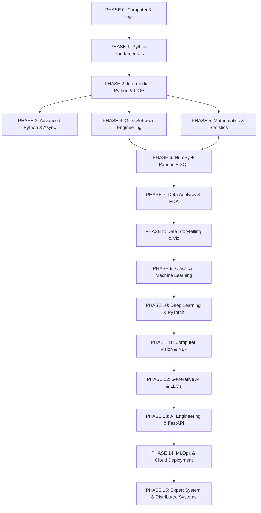

# 🗺️ MASTER ROADMAP: ARSITEKTUR KURIKULUM LENGKAP
> Panduan rinci per fase: What to learn, Why it matters, Prerequisites, Tools, Projects, and Next Steps.

---

### 📌 DAFTAR FASE PERJALANAN (PHASE 0 S/D PHASE 15)

---

## 🔹 PHASE 0: Computer & Programming Fundamentals [MUST MASTER]
- **What to Learn:** Cara kerja CPU, RAM, disk, OS, terminal/CLI, representasi binary/hex, eksekusi kode (compiler vs interpreter), algoritma dasar & flowchart.
- **Why it Matters:** Tanpa pemahaman cara kerja komputer, Anda tidak akan paham mengapa suatu kode efisien atau boros memori.
- **Prerequisites:** Tidak ada (Murni dari nol).
- **Key Skills:** Penguasaan Terminal (Bash / PowerShell), File system navigation, Algoritma logika.
- **Tools:** VS Code, Git Bash / Terminal, draw.io (Flowchart).
- **Mastery Criteria:** Mampu menulis algoritma pseudocode dan flowchart sebelum menulis satu baris pun kode program.

---

## 🔹 PHASE 1: Python Fundamentals [MUST MASTER]
- **What to Learn:** Sintaks Python, variabel, tipe data primitif (`int`, `float`, `str`, `bool`), operator, percabangan (`if-elif-else`), looping (`for`, `while`), fungsi (`def`, parameters, return values, scope).
- **Why it Matters:** Fondasi mutlak semua bidang (Web, Data, AI).
- **Prerequisites:** Phase 0.
- **Key Skills:** Problem solving CLI, clean control flow, penanganan input.
- **Projects:** CLI Interactive Calculator, Number Guessing Game, Multi-Unit Converter.
- **Next Phase:** Phase 2 (Intermediate Python).

---

## 🔹 PHASE 2: Intermediate Python & Data Structures [MUST MASTER]
- **What to Learn:** Built-in structures (`list`, `tuple`, `dict`, `set`), comprehensions, string manipulation, error & exception handling (`try-except-finally`), file I/O (`txt`, `csv`, `json`), virtual environments (`venv`, `pip`), modul & package.
- **Why it Matters:** Data Analyst dan AI Engineer bekerja 90% waktunya memanipulasi struktur data dan file.
- **Prerequisites:** Phase 1.
- **Key Skills:** Data transformation, robust error handling, JSON parsing.
- **Projects:** CLI Personal Finance / Expense Tracker (JSON Storage), CSV Grade Book Analyzer.
- **Next Phase:** Phase 3 & Phase 4.

---

## 🔹 PHASE 3: Object-Oriented Programming & Advanced Python [MUST MASTER]
- **What to Learn:** Class & Object, constructor `__init__`, encapsulation, inheritance, polymorphism, abstraction, magic dunder methods (`__str__`, `__repr__`, `__len__`, `__getitem__`), decorators, generators (`yield`), context managers (`with`), type hints.
- **Why it Matters:** Seluruh library AI seperti PyTorch dan Scikit-Learn dibangun dengan arsitektur OOP dan class-based models.
- **Prerequisites:** Phase 2.
- **Key Skills:** Clean code architecture, modular code reuse, custom data containers.
- **Projects:** OOP Banking Simulator, Point of Sale (POS) Inventory System.
- **Next Phase:** Phase 5 & Phase 6.

---

## 🔹 PHASE 4: Git, Development Tools & Software Engineering [MUST MASTER]
- **What to Learn:** Git version control (`init`, `add`, `commit`, `branch`, `merge`, `rebase`), GitHub PR workflow, code formatting (`ruff`, `black`), type checking (`mypy`), unit testing (`pytest`), virtual environment modern (`uv` / `poetry`).
- **Why it Matters:** Industri tidak menerima kode berantakan tanpa tes dan tanpa version control.
- **Prerequisites:** Phase 2.
- **Key Skills:** Git branching model, automated testing, CI/CD pipeline basics.
- **Projects:** Open-source Python package dengan testing `pytest` otomatis di GitHub Actions.

---

## 🔹 PHASE 5: Mathematics & Statistics for Data & AI [MUST MASTER]
- **What to Learn:**
  - **Aljabar Linier:** Vektor, matriks, dot product, matriks invers, determinan, eigenvalues/eigenvectors.
  - **Kalkulus:** Turunan (derivative), turunan parsial, gradien, aturan rantai (*chain rule*).
  - **Probabilitas & Statistik:** Distribusi normal, mean/median/std, Central Limit Theorem, Hypothesis Testing (t-test, p-value), korelasi vs kausasi.
- **Why it Matters:** Machine learning adalah matematika yang dijalankan oleh komputer.
- **Prerequisites:** Matematika SMA dasar.
- **Key Skills:** Menerjemahkan rumus matematika ke kode Python murni tanpa library.

---

## 🔹 PHASE 6: Data Wrangling Core (NumPy, Pandas, SQL) [MUST MASTER]
- **What to Learn:**
  - **NumPy:** Multi-dimensional arrays (`ndarray`), broadcasting, vectorization, indexing/slicing, linear algebra operations.
  - **Pandas:** Series, DataFrame, selection (`loc`, `iloc`), filtering, handling missing data, `groupby`, `agg`, `merge`, `pivot_table`, time-series index.
  - **SQL:** DDL, DML, `SELECT`, `WHERE`, `GROUP BY`, `HAVING`, `JOIN` (Inner, Left, Outer), Subqueries, Common Table Expressions (`CTE`), Window Functions (`ROW_NUMBER`, `RANK`, `LEAD`, `LAG`).
- **Why it Matters:** Trias data wrangling wajib untuk setiap Data Analyst dan Machine Learning Engineer.
- **Projects:** Analisis Database E-Commerce menggabungkan SQL query + Pandas cleaning + NumPy vectorization.

---

## 🔹 PHASE 7: Exploratory Data Analysis & Business Intelligence [MUST MASTER]
- **What to Learn:** Framework analisis data bisnis: Business Question → Data Cleaning → EDA → Statistical Validation → Actionable Insight. Outlier detection (IQR, Z-Score), cohort analysis, customer churn analysis, funnel analysis.
- **Why it Matters:** Data tanpa rekomendasi bisnis tidak bernilai di perusahaan.
- **Projects:** End-to-End E-Commerce Customer Retention & Cohort Analysis.

---

## 🔹 PHASE 8: Data Visualization & Storytelling [MUST MASTER]
- **What to Learn:** Matplotlib, Seaborn, Plotly (interaktif). Prinsip visual hierarchy, pemilihan chart yang tepat (Line, Bar, Scatter, Boxplot, Heatmap), menghindari misleading chart, dashboard design.
- **Why it Matters:** Komunikasi visual adalah jembatan antara data engineer/analyst dengan direktur/stakeholder non-teknis.
- **Projects:** Executive Interactive Dashboard dengan Plotly / Streamlit.

---

## 🔹 PHASE 9: Classical Machine Learning [MUST MASTER]
- **What to Learn:**
  - **Konsep:** Supervised vs Unsupervised, Train/Test split, K-Fold Cross Validation, Overfitting vs Underfitting, Bias-Variance Tradeoff, Data Leakage.
  - **Regresi:** Linear Regression, Ridge, Lasso, Polynomial.
  - **Klasifikasi:** Logistic Regression, KNN, Naive Bayes, Decision Tree, Random Forest, SVM.
  - **Boosting:** Gradient Boosting, XGBoost, LightGBM, CatBoost.
  - **Unsupervised:** K-Means, Hierarchical Clustering, DBSCAN, PCA (Dimensionality Reduction).
  - **Evaluasi:** Confusion Matrix, Precision, Recall, F1-Score, ROC-AUC, MAE, RMSE, R².
- **Tools:** Scikit-Learn, XGBoost, LightGBM.
- **Projects:** Customer Churn Predictor & Credit Risk Scoring System.

---

## 🔹 PHASE 10: Deep Learning & PyTorch Core [MUST MASTER]
- **What to Learn:** Artificial Neural Networks (ANN), Perceptron, Fungsi Aktivasi (ReLU, Sigmoid, Softmax), Forward & Backpropagation, Loss Functions (CrossEntropy, MSE), Optimizers (SGD, Adam), Learning Rate, Dropout, Batch Normalization.
- **Tools:** **PyTorch** (Tensor, Autograd, `nn.Module`, `DataLoader`, Custom Training Loop).
- **Projects:** Membangun Neural Network dari nol menggunakan NumPy, lalu migrasi ke PyTorch untuk klasifikasi dataset Fashion-MNIST.

---

## 🔹 PHASE 11: Computer Vision & NLP [MUST MASTER]
- **What to Learn:**
  - **Computer Vision:** Convolutional Neural Networks (CNN), Convolution & Pooling, Data Augmentation, Transfer Learning (ResNet, EfficientNet, MobileNet), Object Detection basics.
  - **NLP:** Text preprocessing, Tokenization, Stemming/Lemmatization, TF-IDF, Word Embeddings (Word2Vec), Recurrent Networks (RNN, LSTM, GRU), Attention Mechanism.
- **Tools:** Torchvision, OpenCV, Hugging Face Transformers, NLTK/Spacy.
- **Projects:** Image Classifier (Medical X-Ray / Plant Disease) & NLP Sentiment Analysis Classifier.

---

## 🔹 PHASE 12: Generative AI & Large Language Models (LLM) [MUST MASTER]
- **What to Learn:** Transformer Architecture (Self-Attention, Multi-Head Attention, Encoder-Decoder), LLM Foundations (GPT, LLaMA, Mistral), Prompt Engineering & Structured Outputs, Embeddings & Vector Databases (ChromaDB, FAISS, Qdrant), Retrieval-Augmented Generation (**RAG**), Agentic workflows & Function Calling, Fine-Tuning basics (LoRA, QLoRA).
- **Tools:** Hugging Face, LangChain, LlamaIndex, Ollama, OpenAI/Gemini SDKs.
- **Projects:** Production Enterprise RAG System: Chatbot pintar dokumen PDF / Internal Knowledge Base dengan source citation.

---

## 🔹 PHASE 13: AI Engineering & API Development [MUST MASTER]
- **What to Learn:** FastAPI modern, Pydantic data validation, async request handling, model serialization (`pickle`, `joblib`, ONNX), model inference optimization, token authentication (JWT), background tasks, rate limiting.
- **Why it Matters:** Model ML di notebook Jupyter tidak ada gunanya jika tidak bisa diakses oleh aplikasi web / mobile.
- **Projects:** Production-Ready REST API Machine Learning & LLM inference service dengan OpenAPI Swagger docs.

---

## 🔹 PHASE 14: MLOps, CI/CD & Deployment [MUST MASTER]
- **What to Learn:** Experiment Tracking (`MLflow` / `Weights & Biases`), Data Versioning (`DVC`), Containerization (`Docker`), CI/CD pipeline (GitHub Actions), Cloud Deployment (AWS / GCP / HuggingFace Spaces), Model Monitoring & Data Drift detection.
- **Why it Matters:** Model di production akan mengalami degradasi performa seiring waktu (*drift*) dan harus bisa dideploy ulang secara otomatis.
- **Projects:** End-to-End Automated MLOps Pipeline: Push code → Run tests → Train model → Register in MLflow → Build Docker image → Deploy API.

---

## 🔹 PHASE 15: Expert Topics & Distributed Scalability [OPTIONAL — ADVANCED]
- **What to Learn:** CPython internals, Global Interpreter Lock (GIL), Memory management & Garbage collection, Asynchronous event loop internals, Distributed training (PyTorch DDP, DeepSpeed), Distributed data processing (PySpark, Ray).
- **Why it Matters:** Menangani skala data skala Tera/Petabyte dan melatih model ukuran miliaran parameter di cluster GPU.
